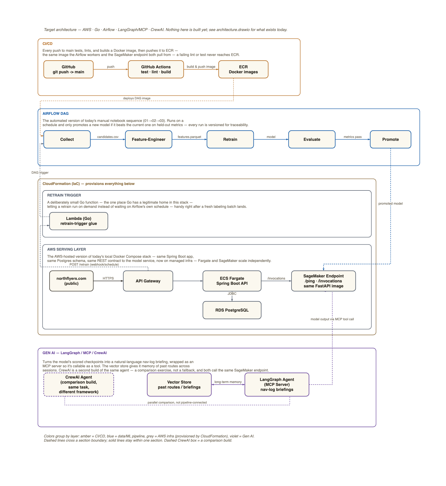

# Target Architecture (Future)

This describes `architecture-future.png` / `architecture-future.drawio` — the
target AWS/Go/Airflow/LangGraph/CrewAI stack this project is aiming toward.
**Nothing in this document is built yet.** For what actually exists today,
see `architecture.drawio` / `architecture.png` and the main `README.md`.

The diagram has four top-level sections, stacked top to bottom in the order
they'd fire on a real push: **CI/CD → Airflow DAG → CloudFormation (which
provisions Retrain Trigger + AWS Serving Layer) → Gen AI**. Each section is
drawn as its own solid-bordered box with a short eyebrow label and a
description in its top-left corner.

## Reading the diagram

- **Box color = which layer owns it.** Amber = CI/CD. Blue = the Airflow
  data/ML pipeline. Grey = AWS infrastructure provisioned by CloudFormation
  (Retrain Trigger + AWS Serving Layer). Violet = the Gen AI agents.
  CloudFormation's own outer box uses a distinct olive/brown so it reads as
  a wrapper around the two grey boxes nested inside it, not a third grey
  thing.
- **Solid vs. dashed connections.** A solid line is a normal same-section
  connection — request/response, a direct pipeline handoff. A dashed line
  is a connection that crosses from one section into another (CI/CD into
  Airflow, Airflow into AWS, AWS into Retrain Trigger, Retrain Trigger back
  into Airflow, Gen AI into AWS) — it's flagging "this is a boundary
  crossing," not a different kind of technology. The one exception:
  `CrewAI Agent → LangGraph Agent` is dashed even though both boxes are
  inside the Gen AI section — that dash means "not pipeline-connected,"
  covered below.
- **Dashed box border = not a pipeline connection.** Only one box uses a
  dashed border: **CrewAI Agent**. That's not about crossing sections, it
  marks the box itself as a second, comparison-only build of the same agent
  — see the Gen AI section below.
- **`northflyers.com` has a black border**, not amber/grey, because it's the
  one box in the diagram that isn't AWS-owned infrastructure — it's the
  public-facing site that happens to call into AWS Serving Layer.

---

## 1. CI/CD (amber)

> Every push to main tests, lints, and builds a Docker image, then pushes it
> to ECR — the same image the Airflow workers and the SageMaker endpoint
> both pull from — a failing lint or test never reaches ECR.

Three boxes, left to right:

1. **GitHub** — `git push -> main`. The trigger for everything else in this
   section.
2. **GitHub Actions** — `test · lint · build`. Runs the test suite and
   linter; only proceeds to build if both pass.
3. **ECR** — `Docker images`. The image registry. This is the single source
   of truth for "what code is actually running" — Airflow's workers and the
   SageMaker endpoint both pull the same image from here, so there's never a
   version-skew question between the batch pipeline and the serving layer.

Connections:

- **GitHub → GitHub Actions**, labeled `push`. A `git push` to `main`
  triggers the Actions workflow.
- **GitHub Actions → ECR**, labeled `build & push image`. On a passing
  test+lint run, the workflow builds the Docker image and pushes it.

## 2. Airflow DAG (blue)

> The automated version of today's manual notebook sequence (01→02→03).
> Runs on a schedule and only promotes a new model if it beats the current
> one on held-out metrics — every run is versioned for traceability.

This is the automated replacement for the three manual notebooks
(`01`/`02`/`03`) that the current pipeline runs by hand. Five boxes, left to
right, each one DAG task:

1. **Collect** — pulls the raw candidate data.
2. **Feature-Engineer** — builds the feature table from what Collect
   gathered.
3. **Retrain** — retrains the model on the engineered features.
4. **Evaluate** — scores the new model against held-out data.
5. **Promote** — only reached if Evaluate says the new model actually beats
   the currently-deployed one; this is the task that makes the new model
   "live."

Connections, each labeled with what's actually handed off between tasks:

- **Collect → Feature-Engineer**, labeled `candidates.csv`.
- **Feature-Engineer → Retrain**, labeled `features.parquet`.
- **Retrain → Evaluate**, labeled `model`.
- **Evaluate → Promote**, labeled `metrics pass` — i.e., this edge only
  "fires" in the sense that Promote only does anything meaningful if the
  metrics comparison passed.

### Connections crossing into/out of this section

- **ECR → Collect**, labeled `deploys DAG image` (dashed — crosses from
  CI/CD into Airflow). The same Docker image CI/CD just built is what the
  Airflow workers run; this is Airflow picking up a new deploy, not a data
  handoff.
- **Promote → SageMaker Endpoint**, labeled `promoted model` (dashed —
  crosses from Airflow down into the AWS Serving Layer, inside
  CloudFormation). Once a model is promoted, it's pushed to the SageMaker
  endpoint that's actually serving traffic.
- **Lambda (Go) → Collect**, labeled `DAG trigger` (dashed — crosses from
  Retrain Trigger back up into Airflow; see section 3b). This is the
  on-demand path into the same DAG the schedule would otherwise trigger.

## 3. CloudFormation (IaC) — provisions everything below

> (Outer wrapper box, olive border) — the label reads "CloudFormation (IaC)
> — provisions everything below."

This box doesn't represent a pipeline step itself — it's a visual wrapper
saying "everything nested inside this box is infrastructure that
CloudFormation stands up," i.e. Retrain Trigger and AWS Serving Layer are
both IaC-managed, not hand-provisioned. It contains two nested sections:

### 3a. Retrain Trigger (grey)

> A deliberately small Go function — the one place Go has a legitimate home
> in this stack — letting a retrain run on demand instead of waiting on
> Airflow's own schedule — handy right after a fresh labeling batch lands.

One box: **Lambda (Go)** — `retrain-trigger glue`. Its only job is to
receive a webhook/schedule hit and kick off an Airflow DAG run outside of
Airflow's own cron schedule. This is called out specifically as the one
place Go appears in the stack — everywhere else in the target architecture
is Python (model/data code) or managed AWS services, so this one small glue
function is a deliberate, contained exception rather than Go creeping into
the rest of the codebase.

Connections:

- **API Gateway → Lambda**, labeled `POST /retrain (webhook/schedule)`
  (dashed — crosses from AWS Serving Layer into Retrain Trigger). This is
  how a retrain actually gets requested: a webhook or scheduled call hits
  API Gateway, which routes it to this Lambda.
- **Lambda → Collect**, labeled `DAG trigger` (dashed, covered above under
  Airflow) — the other end of the same on-demand path, actually starting
  the DAG run.

### 3b. AWS Serving Layer (grey)

> The AWS-hosted version of today's local Docker Compose stack — same
> Spring Boot app, same Postgres schema, same REST contract to the model
> service, now on managed infra — Fargate and SageMaker scale independently.

This section is explicitly framed as "the same thing you already run
locally in Docker Compose, just on managed AWS services" — not a redesign.
Five boxes:

1. **northflyers.com (public)** — black border (not AWS-owned; it's the
   public site). The entry point for real traffic.
2. **API Gateway** — the AWS-managed front door that terminates HTTPS from
   the public site and routes requests onward.
3. **ECS Fargate — Spring Boot API** — the same Spring Boot app from the
   local Docker Compose stack, now running as a managed Fargate task
   instead of a local container.
4. **SageMaker Endpoint** — `/ping · /invocations` — `same FastAPI image`.
   The model-serving container, exposing the same `/ping` health check and
   `/invocations` inference route SageMaker expects, running the identical
   FastAPI image used elsewhere.
5. **RDS PostgreSQL** — the managed database, replacing the local Postgres
   container; same schema as today.

Connections, all within this section (solid):

- **northflyers.com → API Gateway**, labeled `HTTPS`.
- **API Gateway → ECS Fargate**, unlabeled (a direct pass-through — API
  Gateway forwards the request straight to the Spring Boot app).
- **ECS Fargate → SageMaker Endpoint**, labeled `/invocations` — the Spring
  Boot app calling the model service's inference route, same REST contract
  as the local Docker Compose setup.
- **ECS Fargate ↔ RDS PostgreSQL**, labeled `JDBC` (double-headed arrow —
  the Spring Boot app both reads and writes over the JDBC connection).

Connections crossing into/out of this section are covered above
(`promoted model` in from Airflow, `POST /retrain` out to Retrain Trigger,
`model output via MCP tool call` in from Gen AI, below).

## 4. Gen AI — LangGraph / MCP / CrewAI (violet)

> Turns the model's scored checkpoints into a natural-language nav-log
> briefing, wrapped as an MCP server so it's callable as a tool. The vector
> store gives it memory of past routes across sessions. CrewAI is a second
> build of the same agent — a comparison exercise, not a fallback, and both
> call the same SageMaker endpoint.

Three boxes:

1. **CrewAI Agent** — `(comparison build, same task, different framework)`
   — **dashed border**. This is a second, independent implementation of the
   same nav-log-briefing agent, built in CrewAI instead of LangGraph,
   purely to compare the two frameworks on the same task. It is not a
   fallback for LangGraph and not part of the request pipeline — the dashed
   border is the visual cue for "exists in parallel, doesn't feed into
   anything else."
2. **Vector Store** — `past routes / briefings`. Gives the LangGraph agent
   memory of prior routes and briefings across sessions, so it isn't
   starting from scratch on every request.
3. **LangGraph Agent (MCP Server)** — `nav-log briefings`. The actual
   pipeline component: wraps the briefing-generation agent as an MCP server
   so it's callable as a tool, calls the SageMaker endpoint for scored
   checkpoints, and turns that into a natural-language nav-log briefing.

Connections:

- **LangGraph Agent ↔ Vector Store**, labeled `long-term memory`
  (double-headed, solid — both read and write, within the section).
- **CrewAI Agent ↔ LangGraph Agent**, labeled `parallel comparison, not
  pipeline-connected` (dashed, no arrowheads at all — deliberately not
  directional, since neither one calls the other; this line exists purely
  to visually associate the two as "the same task, two builds," not to
  represent data flow).
- **LangGraph Agent → SageMaker Endpoint**, labeled `model output via MCP
  tool call` (dashed — crosses from Gen AI back up into AWS Serving Layer,
  inside CloudFormation). This is the LangGraph agent calling the same
  `/invocations` endpoint Fargate calls, via an MCP tool call, to get the
  model's scored checkpoints it then turns into a briefing.

---

## Full connection reference

| From | To | Label | Style | Crosses section? |
|---|---|---|---|---|
| GitHub | GitHub Actions | push | solid | no (within CI/CD) |
| GitHub Actions | ECR | build & push image | solid | no (within CI/CD) |
| ECR | Collect | deploys DAG image | dashed | CI/CD → Airflow |
| Collect | Feature-Engineer | candidates.csv | solid | no (within Airflow) |
| Feature-Engineer | Retrain | features.parquet | solid | no (within Airflow) |
| Retrain | Evaluate | model | solid | no (within Airflow) |
| Evaluate | Promote | metrics pass | solid | no (within Airflow) |
| Promote | SageMaker Endpoint | promoted model | dashed | Airflow → AWS Serving Layer |
| API Gateway | Lambda (Go) | POST /retrain (webhook/schedule) | dashed | AWS Serving Layer → Retrain Trigger |
| Lambda (Go) | Collect | DAG trigger | dashed | Retrain Trigger → Airflow |
| northflyers.com | API Gateway | HTTPS | solid | no (within AWS Serving Layer) |
| API Gateway | ECS Fargate | *(unlabeled)* | solid | no (within AWS Serving Layer) |
| ECS Fargate | SageMaker Endpoint | /invocations | solid | no (within AWS Serving Layer) |
| ECS Fargate | RDS PostgreSQL | JDBC | solid, bidirectional | no (within AWS Serving Layer) |
| LangGraph Agent | Vector Store | long-term memory | solid, bidirectional | no (within Gen AI) |
| CrewAI Agent | LangGraph Agent | parallel comparison, not pipeline-connected | dashed, no arrowheads | no (within Gen AI — dashed for a different reason, see above) |
| LangGraph Agent | SageMaker Endpoint | model output via MCP tool call | dashed | Gen AI → AWS Serving Layer |

## What's deliberately out of scope here

- **Auth/user accounts** — not shown; nothing in the current project has
  auth yet.
- **A normalized schema for checkpoints** — RDS PostgreSQL is drawn as a
  single box; the actual `routes` table design (JSON column vs. child
  table) isn't part of this diagram.
- **Monitoring/alerting, VPC/networking detail, IAM** — CloudFormation is
  shown as "provisions everything below" at the box level; it doesn't
  enumerate the actual stack resources.

## Where this sits relative to the current state

This is explicitly the *target*, not a plan with a committed timeline —
nothing here is built. Today's actual architecture already has a local
Docker Compose deployment (Model Service / FastAPI stub + Spring Boot API +
Postgres — see the DEPLOYMENT section of `architecture.drawio`), but none
of CI/CD, Airflow, AWS, or the Gen AI layer exist yet. See
`architecture.drawio` / `architecture.png` for the full current-state
picture, including which of *its* boxes and connections are solid
(built & verified) vs. dashed (designed, not yet implemented).
