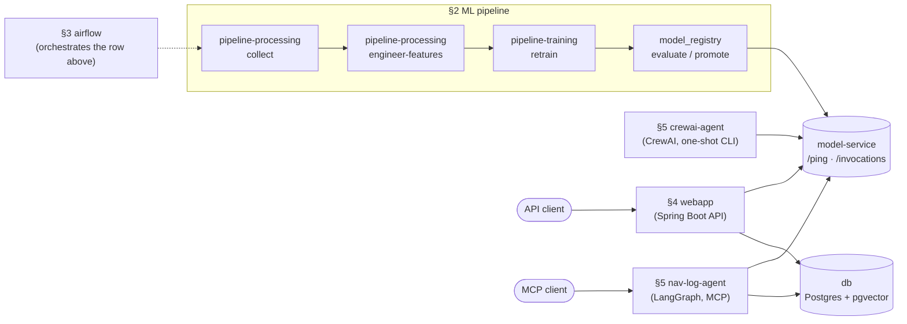
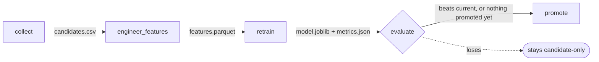
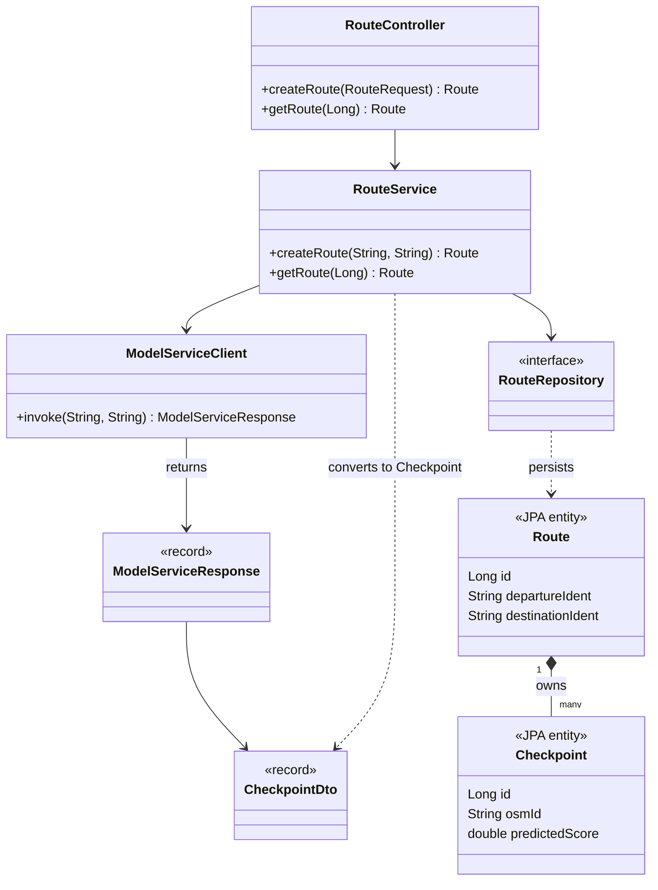
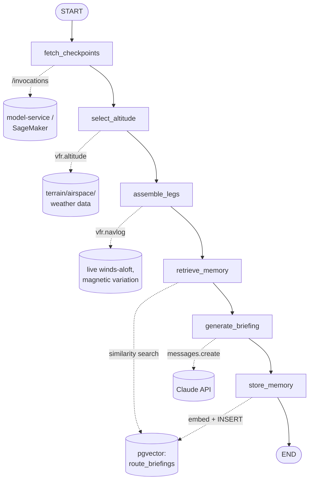

# Learning Guide

## Contents

- [Overview](#overview)
- [1. Docker fundamentals](#1-docker-fundamentals)
- [2. The ML pipeline](#2-the-ml-pipeline)
- [3. Orchestration with Airflow](#3-orchestration-with-airflow)
- [4. The serving layer](#4-the-serving-layer)
- [5. The Gen AI layer](#5-the-gen-ai-layer)
- [6. Database migrations](#6-database-migrations)
- [7. Infrastructure as code (CloudFormation)](#7-infrastructure-as-code-cloudformation)
- [8. What gets tested, and what deliberately doesn't](#8-what-gets-tested-and-what-deliberately-doesnt)
- [Suggested order to build this yourself](#suggested-order-to-build-this-yourself)
- [Appendix](#appendix)

## Overview

A teaching document; `README.md` is the reference. This explains *why*
the repo is built the way it is, concept by concept, so you walk away
able to rebuild something like it yourself, no AI pairing required. Each
section introduces an idea, then shows exactly where in this repo that
idea shows up.

Read it top to bottom the first time; come back to individual sections
later as a refresher while you build.

The whole system, one picture. Every box is a Docker service; every arrow
is covered by name in the section noted next to it:



Everything above `db`/`model-service` runs today exactly as drawn; the
`§7` CloudFormation template re-provisions this same picture on AWS,
service for service — see `docs/README-AWS.md`.

---

## 1. Docker fundamentals

Everything in this project runs in Docker. Before touching this repo's
Dockerfiles, you need four ideas solid:

**Image vs. container.** An image is a frozen filesystem snapshot plus
metadata about how to run it — think of it as a class. A container is a
running (or stopped) instance of that image — an object. `docker build`
produces an image; `docker run` (or `docker compose up`) produces a
container from it.

**Layers.** A Dockerfile is a sequence of instructions, and each one
(`RUN`, `COPY`, etc.) produces a new filesystem layer, cached and stacked
on the previous one. If you change a line near the top of a Dockerfile,
every layer below it gets rebuilt — Docker can't know the change didn't
affect them. That's why `COPY requirements.txt .` followed by `RUN pip
install` almost always comes *before* `COPY app ./app` in this repo's
Dockerfiles: your application code changes constantly, your dependency
list doesn't, so putting the slow, cacheable step (`pip install`) first
means it's skipped on rebuild unless `requirements.txt` itself changed.
Look at [`model-service/Dockerfile`](../model-service/Dockerfile) — that
ordering is deliberate, not incidental.

**Volumes vs. the image filesystem.** Anything `COPY`'d into an image is
frozen at build time. A volume (or bind mount) instead maps a directory on
your host machine into the running container, live. This repo uses bind
mounts heavily — `.:/workspace` shows up in several services in
[`docker-compose.yml`](../docker-compose.yml) — specifically so you can
edit Python source on your host and rerun the container without rebuilding
the image. Compare that to `webapp` and `model-service`, which have *no*
bind mount: their code is `COPY`'d into the image at build time, so you
must rebuild the image to pick up a change. That split is a real decision:
interpreted-language dev containers favor mount-and-iterate; compiled/
packaged services (a Spring Boot JAR, a pip-installed FastAPI app meant to
mirror a real deployable artifact) favor rebuild-and-run, closer to how
they'd actually ship.

**Networking.** Docker Compose puts every service in the same file on one
private network, and each service is reachable from any other by its
*service name* as a hostname — not `localhost`. That's why
[`docker-compose.yml`](../docker-compose.yml)'s `webapp` has
`MODEL_SERVICE_URL: http://model-service:8000`, not
`http://localhost:8000` — `model-service` is DNS-resolvable to the right
container only inside that private network. From your host machine
(outside Compose's network), you *do* use `localhost:8080` etc., because
`ports: ["8080:8080"]` punches a hole from the host into the container.

### Reading a Dockerfile

Six instructions cover almost everything you'll see here:

| Instruction | What it does |
|---|---|
| `FROM` | The base image to start from |
| `WORKDIR` | Sets the working directory for everything after it |
| `COPY <host> <container>` | Copies files from your build context into the image |
| `RUN` | Executes a command *at build time*, baking its result into a layer |
| `ENV` | Sets an environment variable, baked into the image |
| `EXPOSE` | Documentation only — doesn't actually publish a port; `ports:` in Compose does that |
| `CMD` / `ENTRYPOINT` | What runs when a container starts (not at build time) |

`CMD` vs `ENTRYPOINT`: `ENTRYPOINT` is the fixed command; anything passed
to `docker run <image> <args>` (or Compose's `command:`) gets appended as
arguments to it. `CMD` is the *whole* default command, fully overridable.
This repo uses `ENTRYPOINT` for the pipeline images specifically so
`docker compose run --rm pipeline-training retrain` can pass `retrain` as
an argument to a fixed `python3 -m vfr.pipeline` — see
[`docker/Dockerfile.training`](../docker/Dockerfile.training).

### Multi-stage builds

[`springboot-app/Dockerfile`](../springboot-app/Dockerfile) is the one
multi-stage build in this repo:

```dockerfile
FROM maven:3.9-eclipse-temurin-21 AS build
WORKDIR /build
COPY pom.xml .
RUN mvn -q dependency:go-offline
COPY src ./src
RUN mvn -q package -DskipTests

FROM eclipse-temurin:21-jre
WORKDIR /app
COPY --from=build /build/target/*.jar app.jar
EXPOSE 8080
CMD ["java", "-jar", "app.jar"]
```

Two `FROM` lines means two stages. The first stage has the full Maven
toolchain (hundreds of MB) and compiles a JAR. The second stage starts
completely fresh from a *much* smaller JRE-only base image and copies just
the compiled JAR out of the first stage (`COPY --from=build`) — none of
Maven, the `.m2` cache, or the `.java` source files make it into the final
image. This is the standard pattern for any compiled language in Docker:
build fat, ship thin.

### Every Dockerfile in this repo, and why it's shaped that way

| Dockerfile | Base | Why it looks like this |
|---|---|---|
| [`docker/Dockerfile.ml`](../docker/Dockerfile.ml) | `python:3.12-slim` + a JDK | PySpark (notebook 06) needs a JVM even from Python, hence `apt-get install default-jdk-headless`. Installs the CPU-only PyTorch wheel explicitly (`--index-url .../cpu`) — the default wheel bundles several GB of CUDA libraries this machine has no GPU to use. |
| [`docker/Dockerfile.processing`](../docker/Dockerfile.processing) | `python:3.12-slim` | Deliberately thin: pandas/requests/pyarrow only, no scikit-learn. Mirrors what a SageMaker *Processing Job* container needs. |
| [`docker/Dockerfile.training`](../docker/Dockerfile.training) | `python:3.12-slim` | Adds scikit-learn/joblib on top. Kept as a *separate* image from `.processing` rather than one shared image, because Processing and Training are different constructs on AWS with different container contracts — see [Section 2](#2-the-ml-pipeline). |
| [`docker/Dockerfile.airflow`](../docker/Dockerfile.airflow) | `apache/airflow:2.10.4-python3.12` | Adds one provider package (`apache-airflow-providers-docker`) so its DAGs can launch sibling containers. Doesn't need pandas/scikit-learn itself — see [Section 3](#3-orchestration-with-airflow) for why. |
| [`docker/Dockerfile.airflow.aws`](../docker/Dockerfile.airflow.aws) | `apache/airflow:2.10.4-python3.12` | The AWS-hosted counterpart: `apache-airflow-providers-amazon` instead of `-docker`, and it `COPY`s the AWS DAG and `src/` in rather than relying on a bind mount that Fargate has no way to provide. See [Section 3](#the-same-dag-twice-local-and-aws). |
| [`model-service/Dockerfile`](../model-service/Dockerfile) | `python:3.12-slim` | A plain FastAPI service: install deps, copy `app/`, run `uvicorn`. |
| [`springboot-app/Dockerfile`](../springboot-app/Dockerfile) | `maven:...` → `eclipse-temurin:21-jre` | Multi-stage, see above. |
| [`nav-log-agent/Dockerfile`](../nav-log-agent/Dockerfile) / [`crewai-agent/Dockerfile`](../crewai-agent/Dockerfile) | `python:3.12-slim` | Both set `PYTHONPATH=/workspace/src` so `import vfr...` resolves inside the container without installing `vfr` as a package — the bind-mounted repo is just put on the path directly. `nav-log-agent` also installs the CPU-only PyTorch wheel before its requirements, for the reason `Dockerfile.ml` does; see [the images section](#the-images-those-dockerfiles-produce) for what it cost to learn that twice. |

### The images those Dockerfiles produce

A Dockerfile is a recipe; an image is the baked result sitting on your
disk. Running `docker images` on a working copy of this repo shows
seventeen of them, which looks alarming until you see that they are three
different kinds of thing.

**The nine built from this repo.** Compose names them after the project
directory, hence the `vfr_route-` prefix.

| Image | Size | What it is |
|---|---|---|
| `vfr_route-ml` | 6.9 GB | The Jupyter environment for [the notebooks](../notebooks). Easily the largest, and legitimately so: scikit-learn, PyTorch, TensorFlow, PySpark and a JVM in one place. |
| `vfr_route-nav-log-agent` | 2.3 GB | The [LangGraph agent](../nav-log-agent), served over MCP. See [Section 5](#5-the-gen-ai-layer). |
| `vfr_route-airflow` | 2.1 GB | [Orchestration](../docker/Dockerfile.airflow). See [Section 3](#3-orchestration-with-airflow). |
| `vfr_route-crewai-agent` | 1.6 GB | [The same task in CrewAI](../crewai-agent), for comparison. See [Section 5](#crewai--agent-driven-tool-selection). |
| `vfr_route-model-service` | 926 MB | [FastAPI inference](../model-service). See [Section 4](#model-service-fastapi). |
| `vfr_route-planning-service` | 902 MB | [The planner API and chart-vision detector](../planning-service). |
| `vfr_route-pipeline-training` | 878 MB | [Training as an isolated job](../docker/Dockerfile.training). |
| `vfr_route-webapp` | 633 MB | [Spring Boot](../springboot-app) — the public surface, and what serves the front end. Smaller than the Maven image that builds it, which is the multi-stage build working. |
| `vfr_route-pipeline-processing` | 628 MB | [Collection and feature engineering](../docker/Dockerfile.processing). |

**The six pulled, not built.** These look like clutter and are not:
deleting one only forces a re-download on the next build.

| Image | Size | Who needs it |
|---|---|---|
| `python:3.12-slim` | 188 MB | The base for seven of the nine above. One copy, shared — which is why the sizes in the first table are not additive. |
| `node:20-slim` | 290 MB | Builds [the React app](../web), both on its own and inside the webapp build. |
| `maven:3.9-eclipse-temurin-21` | 797 MB | Compiles the Spring Boot JAR. Build-only; never ships. |
| `pgvector/pgvector:pg16` | 621 MB | The actual database: Postgres plus the vector extension for [agent memory](#vector-memory-rag-in-miniature). |
| `postgres:16` | 636 MB | *Not* a duplicate of the above. Testcontainers starts it for the JUnit suite — see [Section 8](#8-what-gets-tested-and-what-deliberately-doesnt). |
| `testcontainers/ryuk` | 28 MB | The janitor that removes leftover test containers when a run dies part-way. |
| `golang:1.25-alpine` | 329 MB | Builds [the retrain-trigger Lambda](../infra/lambda-retrain-trigger). See [Section 7](#7-infrastructure-as-code-cloudformation). |

Two things are worth noticing. `eclipse-temurin:21-jre` is the base of the
running `webapp` image but does not appear in `docker images` at all —
intermediate build stages are not listed under the containerd image store.
And only four of the seventeen run the application: `webapp`,
`planning-service`, `model-service` and the database. Everything else exists for
building, training, orchestrating or testing.

#### The disk lesson

No image is permanently *needed*. Each one is a cache of a build that this
repo can reproduce, so deleting one costs rebuild time and never data.
That distinction matters, because the thing you must not delete is a named
volume: `vfr_route_pgdata` holds the application rows and the agent's
vector memory, and `docker system prune --volumes` — the command everyone
reaches for when a disk fills — takes it with everything else.
[`docker/tidy.sh`](../docker/tidy.sh) exists to be the safe version:
build cache, stopped containers and dangling images, never a volume.

The disk filled anyway, twice, and neither cause was the images:

- **Build cache, 28.8 GB.** `docker system df` reported it as 1.7 GB.
  That figure under-reports badly; do not size a cleanup from it. A
  `docker builder prune -af` returned the real number.
- **CUDA libraries nobody could use, 4.4 GB.** `sentence-transformers`
  pulls `torch`, and the default wheel is a GPU build — 3.2 GB of
  `nvidia/` plus a 1.2 GB `torch`, inside an image that runs on a laptop
  and deploys to Fargate. `Dockerfile.ml` had already solved this, with a
  comment saying why. The fix never reached `nav-log-agent`, which stayed
  9.9 GB until it was measured. One line took it to 2.3 GB.

The second is the more useful lesson: a fix recorded in one Dockerfile did
not propagate to the next one someone wrote. Writing the reason down was
necessary and not sufficient.

### Reading `docker-compose.yml`

Open [`docker-compose.yml`](../docker-compose.yml) side by side with this.
Per service, four keys matter most:

- `build:` — where the Dockerfile is and what directory is the *build
  context* (everything `COPY` can see). Some services build from `.` (the
  repo root, needed when the Dockerfile has to `COPY src ./src` from
  outside its own directory); others build from their own subdirectory
  (`./model-service`) when they're fully self-contained.
- `ports: ["8080:8080"]` — `host:container`. The left side is what you
  type into your browser; the right side is what the app inside actually
  binds to.
- `environment:` — env vars injected into the container. Notice
  `${ANTHROPIC_API_KEY:?...}` on `nav-log-agent`/`crewai-agent` — the
  `:?message` syntax means "fail immediately with this message if the
  variable is unset," which is why those two services refuse to even
  *start* Compose without a key, rather than starting and failing later
  with a confusing auth error.
- `depends_on:` — controls **start order** only (Compose waits for the
  dependency's container to start, not for the app inside it to be
  ready). It does not retry connections — if `webapp` starts faster than
  `db` accepts connections, that's on `webapp`'s own connection-retry
  logic (Spring Boot's, in this case), not Compose.

---

## 2. The ML pipeline

This is the automatable subset of what a data scientist does by hand,
turned into three plain functions in
[`src/vfr/pipeline.py`](../src/vfr/pipeline.py): `collect`,
`engineer_features`, `retrain`. Plus two more in
[`src/vfr/model_registry.py`](../src/vfr/model_registry.py): `evaluate`,
`promote`. Five functions, five pipeline stages, one per notebook (01, 02,
03, 03, 03).



This is the exact shape Section 3's Airflow DAG automates, task for task.

### Two ways to find a checkpoint, and why the second one exists

Everything below describes the tabular pipeline: ask OpenStreetMap and the
FAA what is near the route, turn each answer into a row of numbers, learn
from those. It is the version to read first, because every ML idea in this
project lives in it.

But it has a flaw that took a while to see. The thing being predicted is
"could a pilot spot this **on the sectional chart**", and OSM is not the
chart. So the pipeline kept needing rules to force the two together:
towers dropped because the chart draws every obstacle with one symbol,
water towers dropped because 16 of 17 were not drawn at all, quarries
dropped, unnamed lakes dropped because one blue shape among identical
blue shapes cannot be confirmed as the right one. Each was a real
discovery, and each was a patch over the same mismatch.

[`src/vfr/chartvision.py`](../src/vfr/chartvision.py) removes the
mismatch by reading the chart. A sectional is a cartographic product with
a fixed palette, so the tiles can be segmented directly: pale blue is
water, a saturated dark blue line is a watercourse, yellow is a town,
near-black is linework. What the chart does not draw is not found, so
none of those exclusion rules needs to exist.

Two details in it are worth more than the colour thresholds. A linear
feature is reported where the course **crosses** it, not at its centroid —
the centroid of a river that wanders across a mosaic is a point in a field
somewhere, and the same realisation is already in `vfr.osm`'s
`find_line_crossings`. And chart text is drawn in the same ink as roads,
so "Nepco Lake" and every airport name produced crossings until the
detector started requiring the thing under one to actually run somewhere:
the median near-black blob is one pixel across, while a real road runs for
hundreds.

It is faster for the same reason it is more accurate — 320 nm of corridor
in about five seconds against minutes of Overpass and FAA downloads —
but speed is the side effect. Making the ground truth and the training
signal the same artefact is the point.

### Collect → raw candidates

`collect()` pulls real-world geographic features along a flight corridor
(rivers, railroads, road intersections, named lakes, wind farms, towns,
stadiums, plus airports and VOR navaids) from OpenStreetMap's Overpass
API and the FAA's NASR data, filters them to a corridor around a
straight line between two airports,
and writes them to `data/processed/candidates_c81_kdlh.csv`. If you're new
to geospatial code, the two ideas worth understanding here are
**cross-track distance** (how far off the direct line a point is) and
**along-track distance** (how far along the line, projected) — both live
in [`src/vfr/geo.py`](../src/vfr/geo.py) and are standard great-circle
navigation math, not anything ML-specific.

Which categories are collected is itself a data-quality decision, and the
rule is narrower than "anything visible from a plane": a candidate is
only worth collecting if a pilot can **identify it on the sectional**,
because that is what the 1-5 label is judging. Towers, water towers,
quarries and unnamed lakes were each collected at some point and then
removed against that rule — a sectional draws every obstacle with one
symbol, and an unnamed lake is one blue shape among identical blue
shapes, so neither can be confirmed as *the* feature the marker points
at. Golf courses and forest preserves fail the same test for the opposite
reason: at 1:500,000 the chart draws no boundary for them at all, so even
a 100 km² forest is invisible. Airports go the other way and come from
the FAA's `APT_BASE.csv` rather than OSM or OurAirports, because being
FAA-registered is what tracks with being drawn: two unregistered private
strips had nothing at all at their coordinates, while a registered
private field is drawn as a circled magenta "R". See `CANDIDATE_SPECS` in
[`src/vfr/osm.py`](../src/vfr/osm.py), where every exclusion is recorded
next to the ones that stayed.

### Engineer features → a model-ready table

`engineer_features()` turns those raw candidates into numeric columns a
model can actually consume — this is **feature engineering**, the step
between "raw real-world data" and "what a model sees." Concretely:
one-hot encoding the categorical `category` column
(`pd.get_dummies` → `category_river`, `category_lake_or_pond`, etc.), a
log-transformed size feature (`log_size`, since raw area is heavily
skewed — a few huge lakes would otherwise dominate a linear model), a
computed "elevation prominence" (how much a point stands out from its
surroundings — useful for spotting it from the air), a name-uniqueness
score, and nearest-neighbor distance (how close the next candidate is —
two features that are practically on top of each other are less useful
individually). Result: `data/processed/features_c81_kdlh.parquet`.

### Retrain → model selection

This is the part worth slowing down on if machine learning is new to you.
`retrain()` ([`src/vfr/pipeline.py:221`](../src/vfr/pipeline.py#L221))
does five things, in order, and each is a standard ML pattern you'll see
in any serious project:

1. **Train/test split.** `train_test_split(X, y, test_size=0.2, ...)` sets
   aside 20% of the labeled data that the model *never* sees during
   training. Every metric that matters gets computed on this held-out
   slice — training-set performance tells you almost nothing about how a
   model will do on new data.
2. **Cross-validation, not a single fit.** Within the training set, `KFold(n_splits=5)`
   splits it five ways and fits/scores five times, rotating which slice is
   the validation fold. This gives a much more stable estimate of a
   model's real performance than one lucky (or unlucky) split would.
3. **Hyperparameter search.** `GridSearchCV` tries every combination in a
   parameter grid (e.g. Ridge's `alpha`, RandomForest's `max_depth` and
   `min_samples_leaf`) and keeps whichever combination scored best across
   the 5 folds. This is *inside* the cross-validation loop — the model
   never gets to "peek" at test data while tuning itself.
4. **Compare multiple model families against a dummy baseline.** Ridge
   (linear), RandomForest, and GradientBoosting (both tree ensembles) are
   all grid-searched, and a `DummyRegressor(strategy="mean")` — a model
   that just always predicts the average — is scored the same way. If your
   real models can't beat "always guess the average," something's wrong;
   this baseline is the sanity check.
5. **Final fit + honest scoring.** Whichever model won cross-validation
   gets refit on the *full* training set, then scored exactly once against
   the untouched test set (MAE, RMSE, R²). That held-out score — not the
   CV score — is what actually gets compared during promotion, below.

The model and its metrics are saved to `data/models/candidate/` — notice
the word "candidate," not "current." That distinction is the whole point
of the next step.

**One deliberate guardrail**: `retrain()` refuses to run at all below 30
labeled rows (`MIN_LABELED_ROWS`), raising a clear
`InsufficientLabelsError` instead of letting scikit-learn fail with an
opaque stratification error on a handful of rows. Fail loud, fail early,
fail with a message a human can act on — that's a pattern worth copying
into your own pipelines generally.

It also earned its keep as a *measurement*. At 37 labels the model beat a
predict-the-mean baseline by 0.06% — statistically nothing. At the full
206 it beats it by 11%. The guard's real message is that a model trained
on too little data does not announce itself with an error; it announces
itself by quietly matching the mean.

### Evaluate/promote → a tiny model registry

[`src/vfr/model_registry.py`](../src/vfr/model_registry.py) implements the
**champion/challenger pattern**: `evaluate()` compares the freshly-trained
"candidate" model against whatever's currently "current" (serving), and
returns `True` only if the candidate wins (or nothing has been promoted
yet). `promote()` then copies the candidate into the `current/`
directory — which `model-service` bind-mounts and really does serve
from — and also stashes a timestamped copy under `versions/` for history.
**A new model only goes live if it's measurably better than what's
already live** — this is the single idea that makes an automated
retraining pipeline safe to run unattended instead of silently degrading
production every time it fires.

**Which metric you gate on matters as much as having a gate**, and this
one got it wrong at first. `evaluate()` originally compared
`held_out_mae`, the score on a single train/test split. The first real
decision it ever made rejected a candidate on a gap of 0.0669 — and
recomputing that same statistic across 50 different split seeds, for one
unchanged model, gave a standard deviation of 0.068 and a range from 0.73
to 1.09. The gate was reading noise as signal: across those 50 splits the
two models it was comparing won 25 each. It now gates on `cv_mae`, the
mean across 5 cross-validation folds, which is also what `retrain()`
already used to choose between model families — selecting on one metric
and gating on another was its own quiet inconsistency. The lesson
generalizes: before trusting a comparison, measure how much your
comparison statistic moves when nothing changes.

Notice this module has **zero third-party dependencies** — no pandas, no
scikit-learn, just `json`/`shutil`/`pathlib` from the standard library.
That's deliberate: `evaluate`/`promote` are pure bookkeeping (compare two
numbers, copy two files), not real computation, so they don't need a
heavy environment — which is exactly why they can run in-process inside
Airflow itself rather than needing their own container (next section).

---

## 3. Orchestration with Airflow

A **DAG** (Directed Acyclic Graph) is just a set of tasks with dependency
edges between them, and no cycles. Airflow's job is to run each task, in
dependency order, and give you retries/logging/scheduling/a UI for free.
Open [`airflow/dags/vfr_pipeline_dag.py`](../airflow/dags/vfr_pipeline_dag.py):

```python
collect >> feature_engineer >> retrain >> evaluate >> promote()
```

That `>>` operator *is* the dependency graph — "run `feature_engineer`
only after `collect` succeeds," and so on down the chain. That's the
entire DAG structure; everything else in the file is building the task
objects that go on either side of those `>>`s.

**Operators** are Airflow's unit of "how a task actually runs":
`DockerOperator` launches a task as its own Docker container;
`PythonOperator`/the `@task` decorator runs a task as a plain Python
function inside the Airflow worker itself; `ShortCircuitOperator` is a
`PythonOperator` variant that stops the whole downstream chain if its
callable returns falsy — that's exactly `evaluate` here: if the candidate
model doesn't beat the current one, `promote()` never even runs.

**Why `Collect`/`Feature-Engineer`/`Retrain` launch as separate
*containers*, not Python functions inside Airflow itself:** because on
AWS, they won't be Airflow-hosted compute at all — they'll be SageMaker
Processing/Training Jobs, run by SageMaker's own infrastructure, with
Airflow only responsible for *starting* them and waiting for a result.
`DockerOperator` is the local stand-in for that same separation of
concerns: Airflow orchestrates, something else does the actual compute.
Look at `_docker_task()` in the DAG file — it talks to the **host's**
Docker daemon over a mounted socket
(`docker_url="unix://var/run/docker.sock"`, and that socket is bind-mounted
into the `airflow` container in `docker-compose.yml`), which is what lets a
process running *inside* a container launch a sibling container next to
it, rather than a nested one inside itself.

One sharp edge worth understanding, not just copying: `DockerOperator`'s
mounts are resolved by the **host's** Docker daemon, not by paths as seen
from inside the `airflow` container. `PROJECT_HOST_PATH` (an env var
Compose passes through as `${PWD}`) exists solely to give the DAG the
*host's* real filesystem path to this project, since `/opt/airflow/project`
(the path *inside* the `airflow` container) means nothing to the host
daemon receiving the mount request.

### The same DAG, twice: local and AWS

There are two DAG files, and the reason is worth understanding because
it's a constraint you'll hit any time an orchestrator moves to managed
infrastructure.

[`vfr_pipeline_dag.py`](../airflow/dags/vfr_pipeline_dag.py) is the local
one described above: `DockerOperator` launching sibling containers over
the host's Docker socket. On Fargate there *is* no host Docker socket to
mount and no sibling containers to launch — that whole mechanism is a
local-development affordance, not something that ports.

[`vfr_pipeline_aws_dag.py`](../airflow/dags/vfr_pipeline_aws_dag.py) is
the AWS counterpart. Same five tasks, same order, same
`ShortCircuitOperator` gate on Evaluate — but Collect/Feature-Engineer
become `SageMakerProcessingOperator` jobs and Retrain becomes a
`SageMakerTrainingOperator` job. Airflow's role shrinks to exactly what it
should be on AWS: submit the job, poll for completion, move on. The
compute happens on SageMaker's infrastructure, not Airflow's.

Three details in that file worth calling out, because each is a real
constraint rather than a style choice:

- **Processing Jobs let you override the container's entrypoint and
  arguments; Training Jobs don't.** `AppSpecification.ContainerEntrypoint`
  /`ContainerArguments` exist for Processing, so Collect and
  Feature-Engineer pass `collect` / `engineer-features` explicitly. A
  Training Job just runs the image's own `ENTRYPOINT`/`CMD` unchanged —
  which is exactly why [`docker/Dockerfile.training`](../docker/Dockerfile.training)
  carries `CMD ["retrain"]`. The Dockerfile has that line *because of* how
  SageMaker invokes it.
- **Configuration comes from Airflow Variables, not hardcoded values.**
  The S3 bucket, the job role ARN, and the two image URIs are per-account
  facts a DAG file shouldn't contain, so they're read via
  `Variable.get(...)` and set once after deploy.
- **Evaluate/Promote stay in-process**, exactly as locally, for the same
  reason: `vfr.model_registry` is pure standard library, so there's no
  compute to hand off to anything.

Because the two DAGs can't coexist (the local one would fail to parse on
Fargate — it reads `PROJECT_HOST_PATH`, which doesn't exist there),
[`docker/Dockerfile.airflow.aws`](../docker/Dockerfile.airflow.aws) bakes
in *only* the AWS DAG plus `apache-airflow-providers-amazon`, while the
local [`docker/Dockerfile.airflow`](../docker/Dockerfile.airflow) relies
on the Compose bind mount for its own. Two images, one per environment,
rather than one image with a runtime branch.

---

## 4. The serving layer

Two services answer real HTTP requests: `model-service` (predictions) and
`webapp` (the public API, persistence).

### model-service (FastAPI)

[`model-service/app/main.py`](../model-service/app/main.py) is
deliberately minimal: two routes, `/ping` (health check) and
`/invocations` (inference). Those exact names aren't arbitrary — they're
what a **SageMaker real-time inference container** is required to expose.
Building to that contract from day one means the container doesn't need
restructuring later to actually run on SageMaker; only *what's inside*
`/invocations` changes — and that payoff was collected for real. It held
a hand-written stub until labeling finished; swapping in real inference
touched only the body of that route, never its shape or its name.

The same idea extends to *where* it reads from. The model loads from
`MODEL_DIR`, defaulting to `/opt/ml/model` — the path SageMaker mounts a
model artifact at — and docker-compose bind-mounts `data/models/current`
there, so identical code serves locally and on AWS.

One thing it deliberately refuses to do: score an arbitrary route.
Building features for a new corridor means Overpass queries, FAA
downloads and a per-candidate elevation lookup — minutes of network I/O.
That is a batch job, so a request for an unknown route returns 400 rather
than pretending. On AWS the same split holds: a Processing Job builds
features, an endpoint scores them.

### Select → the checkpoints actually flown

A scored ranking is not a flight plan.
[`src/vfr/checkpoints.py`](../src/vfr/checkpoints.py) is the step between
them: `select_checkpoints()` walks the model's candidates highest-score
first and takes each one that sits at least `min_spacing_nm` from
everything already chosen. On C81→KDLH that turns 206 scored candidates
into 21 checkpoints and 20 legs, averaging 15.7 nm apart.

This step is worth its own section because its *absence* was invisible for
weeks. `predicted_score` was plumbed through the FastAPI response, the
Java DTO and a database column, and no code anywhere branched on it — both
agents zipped the entire candidate list into consecutive legs, producing a
205-leg "nav log". Every test passed, every service was healthy, and the
model's output decided nothing. When you add a model to a system, the
question that catches this is not "is the model good?" but **"what line of
code changes its behaviour because of the model's answer?"**

Two design notes. Selection is greedy rather than an optimal dynamic
program because there is no principled exchange rate between "a better
checkpoint" and "more even spacing" — and greedy has the property that
matters, which is that the best feature on the route never gets dropped to
tidy up spacing elsewhere. And a minimum score means a barren stretch
yields a genuinely long leg instead of a checkpoint the pilot will look
for and fail to see; `selection_gaps_nm()` exists so that gap can be shown
rather than hidden.

### webapp (Spring Boot)

Standard Spring Boot layering, and worth knowing even outside this
project since it's close to an industry-default shape:

- **Controller** ([`RouteController.java`](../springboot-app/src/main/java/com/northflyers/vfr/controller/RouteController.java)) —
  the HTTP boundary. `@RestController` + `@RequestMapping("/api/routes")`;
  each method maps to one route+verb (`@PostMapping`, `@GetMapping`).
  Controllers should stay thin — this one just calls into `RouteService`
  and wraps the result in a `ResponseEntity`, no business logic.
- **Service** ([`RouteService.java`](../springboot-app/src/main/java/com/northflyers/vfr/service/RouteService.java)) —
  the actual logic: call `model-service`, build a `Route`, save it.
- **Repository** (`RouteRepository.java`) — a Spring Data JPA interface;
  you don't implement it, Spring generates the implementation at startup
  from the method names/annotations.
- **Domain** (`Route.java`, `Checkpoint.java`) — the JPA entities, mapped
  to actual database tables.
- **DTO** (`RouteRequest.java`, `ModelServiceRequest`/`Response.java`,
  `CheckpointDto.java`) — plain data-carrying objects for what crosses a
  boundary (an HTTP request/response), kept separate from the JPA
  entities so your API shape and your database shape are free to diverge.
  `CheckpointDto` (what `model-service` returns) and `Checkpoint` (what
  gets persisted) look almost identical, but staying two classes is the
  point: `Route`'s constructor converts one into the other, so a change
  to model-service's response shape doesn't silently ripple into the
  database schema, and vice versa.



[`ModelServiceClient.java`](../springboot-app/src/main/java/com/northflyers/vfr/service/ModelServiceClient.java)
has two invocation paths behind one method, `invoke()`: a `WebClient` HTTP
call to `model-service`'s `/invocations` locally, or SageMaker Runtime's
`InvokeEndpoint` API on AWS, where `model-service`'s image *is* the
SageMaker Endpoint's serving container rather than a plain HTTP service.
Which path runs is decided by whether `SAGEMAKER_ENDPOINT_NAME` is set —
true only on AWS — not a separate build or profile; both paths send/parse
the identical JSON contract, since SageMaker's `InvokeEndpoint` just
proxies the request body straight to the same `/invocations` route.

**Schema ownership**: this app does *not* let Hibernate auto-generate or
alter its schema in a real environment (`ddl-auto: validate`, not
`update`) — the actual schema is owned by **Flyway**, versioned SQL files
under `src/main/resources/db/migration/V<N>__*.sql`, applied automatically
on startup and tracked in a `flyway_schema_history` table so Flyway always
knows exactly which migrations have run. This is the standard way to
manage a real production schema: `ddl-auto: update` is convenient for a
throwaway prototype and dangerous for anything you intend to keep running,
because it can silently alter or drop columns based on what your Java
entities currently look like.

**Health checks**: Spring Boot Actuator exposes
`/actuator/health/liveness` and `/actuator/health/readiness` — the two
checks a container orchestrator (ECS, Kubernetes, anything) needs:
*liveness* answers "is this process healthy, or should it be killed and
restarted," *readiness* answers "should traffic be routed to this
instance right now" (e.g. it might be alive but still warming up, or
temporarily unable to reach its database). Different questions, different
endpoints, on purpose.

---

## 5. The Gen AI layer

Two independent implementations of the same task exist here specifically
so you can compare two different ways of building an LLM agent.

### What "an agent" actually means here

Both builds do the same five things: fetch model-predicted checkpoints,
compute a recommended cruising altitude from real terrain/airspace/weather
constraints, compute dead-reckoning legs between checkpoints, retrieve
similar past routes from memory, and ask an LLM to turn all of that into a
natural-language briefing. The *only* place either build actually calls an
LLM is that last step — everything else is deterministic Python you could
run without any AI involved at all. That's worth internalizing: "agent"
doesn't mean "the LLM does everything," it usually means "deterministic
code does the heavy lifting, and an LLM handles the part that's genuinely
about language."

### LangGraph — explicit state machine

[`nav-log-agent/app/graph.py`](../nav-log-agent/app/graph.py) builds a
`StateGraph`: a shared, typed state object (`NavLogState`, a
`TypedDict`) that flows through a fixed sequence of plain Python
functions, each one reading some keys off the state and returning a dict
of new/updated keys:

```python
graph.add_edge(START, "fetch_checkpoints")
graph.add_edge("fetch_checkpoints", "select_altitude")
graph.add_edge("select_altitude", "assemble_legs")
graph.add_edge("assemble_legs", "retrieve_memory")
graph.add_edge("retrieve_memory", "generate_briefing")
graph.add_edge("generate_briefing", "store_memory")
graph.add_edge("store_memory", END)
```

Six nodes, six edges, no branching — control flow is decided by *you*,
the developer, at graph-build time, not by the LLM at runtime. This is the
right choice whenever you actually know the steps your task needs; you're
using LangGraph here for state management and observability, not because
you need an LLM to decide what to do next. Same six nodes, with what each
one actually touches outside the graph itself:



Only two nodes (`fetch_checkpoints`, `generate_briefing`) call something
that can meaningfully fail at runtime over the network — that's the graph
telling you where to expect retries/error-handling to matter most, not an
accident of how it was drawn.

### MCP (Model Context Protocol)

[`nav-log-agent/app/mcp_server.py`](../nav-log-agent/app/mcp_server.py)
wraps the compiled LangGraph as one callable **tool**,
`generate_nav_log_briefing(...)`, exposed over MCP — a standard protocol
for "here is a tool an LLM client can call, with a typed signature and a
description," transport-agnostic (this one runs over SSE — see
[`app/main.py`](../nav-log-agent/app/main.py)'s `mcp.run(transport="sse")`).
The point of MCP specifically: any MCP-speaking client (Claude Desktop,
another agent, a different app entirely) can discover and call this tool
without you writing a bespoke integration for each one — you write the
tool once, against the protocol, not against a specific caller.

### Vector memory (RAG, in miniature)

`retrieve_memory`/`store_memory` in the graph are a small
**retrieval-augmented generation** loop: past briefings are embedded (text
→ a fixed-length numeric vector capturing its meaning, via a local
`sentence-transformers` model, `all-MiniLM-L6-v2` — no external API call
needed for this part) and stored in Postgres using the **pgvector**
extension, which adds vector columns and nearest-neighbor similarity
search directly to SQL. `retrieve_memory` embeds the *current* query the
same way and asks pgvector for the most similar stored briefings; those
get folded into the prompt `generate_briefing` sends to Claude, so the
model has relevant precedent to draw on instead of starting cold every
time. `store_memory` then embeds and saves the new briefing, so the store
grows with use. Schema for this lives in
[`nav-log-agent/app/migrations/`](../nav-log-agent/app/migrations/),
applied by a small hand-rolled runner
([`app/migrations.py`](../nav-log-agent/app/migrations.py)) rather than a
full ORM/migration framework — see [Section 6](#6-database-migrations).

### CrewAI — agent-driven tool selection

[`crewai-agent/app/tools.py`](../crewai-agent/app/tools.py) wraps the
*exact same* underlying calls (`vfr.altitude`, `vfr.navlog`, the same
`model_client`) as three `@tool`-decorated functions, each with a
docstring the LLM reads to decide when/whether to call it. The structural
difference from LangGraph: instead of you wiring a fixed sequence of
edges, you hand an `Agent` a goal and a set of tools, and the *LLM itself*
reasons, at runtime, about which tools to call and in what order. That's
strictly more flexible and strictly less predictable — worth building once
yourself on a real task (as this repo does) so you feel the tradeoff
directly rather than taking it on faith: explicit graphs are easier to
debug, test, and reason about; agent-driven tool use handles novel
situations a fixed graph wasn't built for, at the cost of predictability.

---

## 6. Database migrations

Two independent schemas share the one `db` Postgres container, each owned
by its own service, each solving the same problem differently:

**`webapp` uses Flyway** — an industry-standard migration tool. You add a
new file, `V<N>__description.sql`, and Flyway applies any files newer than
what it's already tracked (in a `flyway_schema_history` table) on next
startup, in version order, once each, forever. Never edit an already-applied
migration file — add a new one instead; Flyway (like every migration
tool) assumes each version's content is immutable once it's run anywhere.

**`nav-log-agent` uses a ~15-line hand-rolled equivalent**
([`app/migrations.py`](../nav-log-agent/app/migrations.py)), because
there's no ORM on the Python side to bring a full migration framework
along with it, and pulling one in for one table would be overkill. It does
the same conceptual thing at a much smaller scale: a `schema_migrations`
table tracking applied version numbers, and a loop that runs any
`V*.sql` file whose version isn't in that table yet. Reading this file is
a good exercise in its own right — it's short enough to fully understand
in five minutes, and it'll teach you what tools like Flyway are actually
doing underneath their much larger feature set.

The pattern **both** replace: letting your ORM auto-generate schema
changes at startup based on what your code currently looks like (JPA's
`ddl-auto: update`, or an ad-hoc `CREATE TABLE IF NOT EXISTS` on every
connection). That works fine until you need to *rename* a column, backfill
data, or run the same migration across multiple environments in a
guaranteed order — none of which "auto-generate from current code" can do
safely.

---

## 7. Infrastructure as code (CloudFormation)

[`infra/cloudformation/template.yaml`](../infra/cloudformation/template.yaml)
describes AWS resources declaratively — you write *what* should exist, not
a script of *how* to create it — and CloudFormation figures out the
create/update/delete order from the dependency graph implied by
`!Ref`/`!GetAtt` between resources. Core vocabulary, all present in this
template:

- **Parameters** — inputs supplied at deploy time (`VpcId`,
  `WebappImageUri`, etc.), so the same template can be deployed to
  different environments without editing it.
- **Resources** — the actual AWS objects to create (an ECS service, an RDS
  instance, a Lambda function, ...). This is the bulk of any template.
- **Conditions** — boolean expressions (e.g. "was this optional parameter
  actually supplied?") used with `!If` to make a resource or property
  optional based on parameter values.
- **Outputs** — values (like the ALB's DNS name) surfaced after a
  successful deploy, so other tooling — or a human — can find them without
  digging through the console.

`cfn-lint` is a *static* validator — it checks the template's shape
against the AWS resource specification (required properties, valid enum
values, cross-references that don't resolve) without ever touching a real
AWS account. It's a genuinely useful first gate — three real mistakes were
caught by it while building this template (a `Description` property in
the wrong place, a missing `UpdateReplacePolicy`, an invalid RDS engine
version) — but passing it is not the same as a template being
deployable: IAM permission gaps, real VPC/subnet compatibility, and AWS
account quotas are only provable by actually running
`aws cloudformation deploy`.

### Patterns worth stealing from this template

The vocabulary above is generic. These are the specific decisions in
`template.yaml` that are worth understanding, because each one solves a
problem you'll meet in any real deployment:

- **One load balancer, many services.** `webapp` gets the ALB's default
  action; `nav-log-agent` gets a `ListenerRule` matching `/mcp/*` and
  forwards to its own target group. A second service does *not* need a
  second (hourly-billed) load balancer. The catch: path-based routing only
  works if the app actually serves those paths, which is why
  `nav-log-agent` passes explicit `sse_path`/`message_path` rather than
  accepting its library's unprefixed defaults — the infrastructure and the
  application had to agree on a contract.
- **A service that isn't a service.** `crewai-agent` is a
  `TaskDefinition` with no `Service` attached. It's a one-shot CLI, so
  there's nothing to keep running; you invoke it with `aws ecs run-task`.
  Registering a task definition without a service is the ECS equivalent of
  "here's how to run this thing" without also saying "and keep one alive
  at all times."
- **Stateful containers need somewhere to put state.** Fargate task
  storage is ephemeral, so Airflow's SQLite metadata DB would reset on
  every restart. An EFS volume, mounted via an `AccessPoint`, survives.
  The gotcha: the access point's POSIX UID must match the user *inside*
  the image (`50000` for `apache/airflow`, not the more common `1000`), or
  the mount is read-only in practice.
- **Service discovery instead of hardcoded addresses.** The Lambda needs
  Airflow's address, but a Fargate task's IP changes on every restart.
  Cloud Map gives it a stable DNS name (`airflow.vfr-route.internal`), so
  the Lambda's `AIRFLOW_BASE_URL` is a fixed string this stack owns both
  ends of, rather than a parameter someone has to look up and supply.
- **`iam:PassRole` is its own permission.** Airflow doesn't just need
  permission to *create* SageMaker jobs — it needs permission to hand
  those jobs an execution role. Two distinct grants: `sagemaker:Create*`
  on the job, and `iam:PassRole` scoped to exactly the one role it's
  allowed to pass. Forgetting the second is a classic first-deploy
  failure, and the error message rarely says "PassRole" plainly.

The Go Lambda ([`infra/lambda-retrain-trigger/main.go`](../infra/lambda-retrain-trigger/main.go))
is a small, complete example of the standard Lambda shape: a `handler`
function with the signature Lambda expects, registered via
`lambda.Start(handler)` in `main()`. Worth reading end to end — at ~120
lines it's short enough to see the whole request lifecycle: parse the
incoming event, fetch a secret from Secrets Manager, make an outbound HTTP
call, shape a response.

---

## 8. What gets tested, and what deliberately doesn't

Most projects this shape have a testing story that's either "everything is
mocked" or "there are no tests." This one draws the line by asking what a
given test would actually prove.

**Pure logic gets unit tests.** `tests/` (pytest, 103 tests) covers the
parts of `src/vfr` that are functions of their inputs and nothing else:
great-circle math in `vfr.geo`, engineered features, the
wind-correction-angle math in `vfr.navlog`, `model_registry`'s
evaluate/promote decision, and the remote-URI guards. These are fast,
deterministic, and worth having because the math is genuinely easy to get
subtly wrong.

**Browser logic counts as pure logic.** This one was learned the hard
way. The planner has two pages of JavaScript and had no tests at all,
while the Python side had a hundred — and nearly every fault in a day of
building was in the browser: a `TypeError` on every selection because
`L.layerGroup` has no `bringToFront` (only `FeatureGroup` does), a
function written and never called because the edit that was meant to wire
it in matched nothing, page state maintained on one of two code paths so
the surviving path never set it.

The fix was not to reach for a browser-automation harness. It was to
notice that the faults were *decisions*, not drawing: which points a
filter admits, what counts as rated, which way the arrows step, which leg
leaves a checkpoint. Those are functions of plain objects, so
[`web/src/features/label/logic.ts`](../web/src/features/label/logic.ts) and
[`web/src/features/plan/format.ts`](../web/src/features/plan/format.ts) hold them and
`vitest` covers them in well under a second with no browser anywhere.
What is left in the components — binding Leaflet layers, rendering rows —
is the part where a test would mostly restate the code.

The general lesson is worth more than the JavaScript: when something is
hard to test, it is often because a decision and its rendering are
tangled together, and separating them is what makes both better.

The one fault this did *not* catch is worth recording next to it. After
the port, both pages drew the whole United States instead of the leg: the
CSS was written when the layout rows were children of `<body>`, which is
a flex column, and React mounts them inside `#root`, which is not, so the
map inherited no height and Leaflet fitted the route against a container
it had measured wrong. No pure function was wrong and no test could have
failed. It was found by rendering the pages headless and *looking* at
them — which is the other half of the lesson: separating decisions from
rendering makes the decisions testable, and leaves rendering as the part
you still have to go and look at.

**Contracts get slice tests.** `RouteControllerTest` uses `@WebMvcTest`
with the service layer mocked, because what it's testing is the *HTTP
contract* — does a blank ident produce a 400 with usable field errors,
does an unreachable model-service produce a 502 rather than a leaky 500.
Booting a database to answer those questions would only slow them down.

**Integration points get real infrastructure.**
[`RoutePersistenceTest`](../springboot-app/src/test/java/com/northflyers/vfr/RoutePersistenceTest.java)
starts an actual Postgres via Testcontainers, because the things it
verifies can only be verified against a real database: that Flyway's
migrations apply in order, that `ddl-auto: validate` agrees the JPA
entities match the schema those migrations produced, and that the
normalized route→checkpoints mapping round-trips with cascade and
ordering intact. An in-memory H2 would happily pass while the real
Postgres rejected the same SQL — which would make the test worse than
useless, since it would produce false confidence.

That middle claim is the valuable one. Entity/schema drift is a classic
production failure: someone adds a field to a JPA entity, forgets the
migration, and it only surfaces at deploy. Having `validate` run against
migrated schema *in CI* turns that into a failing build instead.

**Some things are left to manual verification, on purpose.** Anything
requiring live network calls or a trained model — `collect`,
`engineer_features`, `retrain`, `vfr.altitude`, `vfr.airspace` — isn't
unit-tested. Mocking the Overpass API or the FAA's data format would test
the mock, not the integration, and the real value in those paths is
whether live upstream data still parses. Those get exercised by running
them for real against the live route. Knowing *which* category a piece of
code falls into is most of the skill here.

---

## Suggested order to build this yourself

If you wanted to build a project like this from a blank repo, roughly this
order tracks how the pieces actually depend on each other (and matches
how this repo itself was actually built):

1. **Data + a notebook.** Get comfortable pulling and shaping real data
   before writing any pipeline code around it.
2. **Model selection, by hand, in a notebook.** Compare a few model
   families against a dummy baseline before automating anything.
3. **Turn the notebook into plain functions**, no framework — this repo's
   `collect`/`engineer_features`/`retrain`/`evaluate`/`promote`. If you
   can't call your pipeline from a plain Python REPL, an orchestrator
   won't fix that. This is also the cheapest moment to unit-test the
   pure-logic parts, while they're still plain functions with no framework
   around them (see [Section 8](#8-what-gets-tested-and-what-deliberately-doesnt)).
4. **Put those functions behind Docker**, one image per differently-shaped
   compute need (not one giant image).
5. **Add an orchestrator** (Airflow) once you have more than one manual
   step to sequence.
6. **Add the serving layer** — a thin inference API first, then whatever
   calls it.
7. **Add the AI/agent layer last**, once the deterministic parts it leans
   on already work and are trustworthy on their own.
8. **Write infrastructure as code once the local shape is stable** — it's
   much cheaper to get the CloudFormation right when you're translating an
   already-working local architecture than when you're still discovering
   what the architecture should be.

## Appendix

### Further reading

| Doc | For |
|---|---|
| [`README.md`](README.md) | The finished picture, and the exact commands to run any of this today. |
| [`README-AWS.md`](README-AWS.md) | Step 8 above, in full — the target architecture and the deploy runbook. |
