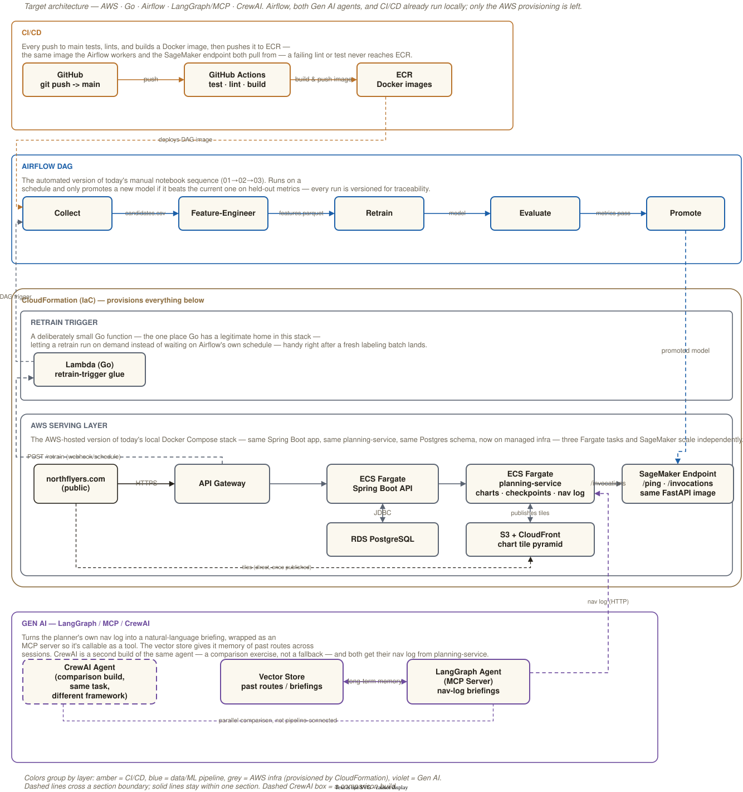

# Target Architecture (AWS)

## Contents

- **[Overview](#overview)** — [Reading the diagram](#reading-the-diagram)
- **[Architecture Diagram](#architecture-diagram)** — [1. CI/CD](#1-cicd-amber) · [2. Airflow DAG](#2-airflow-dag-blue) · [3. CloudFormation](#3-cloudformation-iac--provisions-everything-below) · [4. Gen AI](#4-gen-ai--langgraph--mcp--crewai-violet)
- **[Infrastructure as Code](#infrastructure-as-code)** — [Where this sits relative to the current state](#where-this-sits-relative-to-the-current-state)
- **[Deployment Guide](#deployment-guide)** — [AWS account setup](#aws-account-setup-one-time) · [Deploy runbook](#deploy-runbook) · [Rollback / teardown](#rollback--teardown) · [Cost awareness](#cost-awareness)
- **[Appendix](#appendix)** — [Full connection reference](#full-connection-reference) · [CloudFormation parameter reference](#cloudformation-parameter-reference) · [AWS-specific gotchas](#aws-specific-gotchas)

## Overview

A box-by-box walkthrough of `architecture-aws.svg` — the AWS/Go/Airflow/
LangGraph/CrewAI stack this project is built toward — followed by the
infrastructure-as-code that implements it and the runbook to deploy it.



<sub>Editable source: `architecture-aws.drawio`. The rendered SVG also has
the diagram embedded in it, so opening `architecture-aws.svg` directly in
[draw.io](https://app.diagrams.net) (or the VS Code draw.io extension)
works too.</sub>

The diagram has four top-level sections, stacked top to bottom in the order
they'd fire on a real push: **CI/CD → Airflow DAG → CloudFormation (which
provisions Retrain Trigger + AWS Serving Layer) → Gen AI**.

### Reading the diagram

- **Box color = which layer owns it.** Amber = CI/CD. Blue = the Airflow
  data/ML pipeline. Grey = AWS infrastructure provisioned by CloudFormation.
  Violet = the Gen AI agents. CloudFormation's own outer box uses a
  distinct olive/brown, reading as a wrapper around the two grey boxes
  nested inside it.
- **Solid vs. dashed connections.** Solid = a normal same-section
  connection. Dashed = a connection crossing from one section into
  another. The one exception: `CrewAI Agent → LangGraph Agent` is dashed
  even though both are inside Gen AI — that dash means "not
  pipeline-connected," covered below.
- **Dashed box border = not a pipeline connection.** Only **CrewAI Agent**
  uses one — it's a second, comparison-only build of the same agent.
- **`northflyers.com` has a black border**, not amber/grey — it's the one
  box that isn't AWS-owned infrastructure.

## Architecture Diagram

### 1. CI/CD (amber)

> Every push to main tests, lints, and builds a Docker image, then pushes
> it to ECR — the same image Airflow's workers and the SageMaker endpoint
> both pull from.

**GitHub** (`git push -> main`) → **GitHub Actions** (`test · lint ·
build`) → **ECR** (`Docker images`). A failing test or lint never reaches
ECR; a passing run pushes.

### 2. Airflow DAG (blue)

> The automated version of the manual notebook sequence (01→02→03). Only
> promotes a new model if it beats the current one on held-out metrics.

Five tasks, left to right: **Collect** → **Feature-Engineer** → **Retrain**
→ **Evaluate** → **Promote** (reached only if Evaluate's metrics
comparison passes — this is the task that makes a model "live").

Crossing connections:

- **ECR → Collect** (`deploys DAG image`) — the image CI/CD just built is what Airflow's workers run
- **Promote → SageMaker Endpoint** (`promoted model`) — a promoted model goes live there
- **Lambda (Go) → Collect** (`DAG trigger`) — the on-demand path into this same DAG

### 3. CloudFormation (IaC) — provisions everything below

The outer wrapper box: everything nested inside is CloudFormation-managed
infrastructure. Two nested sections:

#### 3a. Retrain Trigger (grey)

> A deliberately small Go function — the one place Go has a legitimate
> home in this stack — letting a retrain run on demand instead of waiting
> on Airflow's schedule.

One box, **Lambda (Go)**: receives a webhook/schedule hit via API Gateway
(`POST /retrain`) and kicks off an Airflow DAG run.

#### 3b. AWS Serving Layer (grey)

> The AWS-hosted version of the local Docker Compose stack — same Spring
> Boot app, same Postgres schema, same REST contract to the model service,
> on managed infra that scales independently.

**northflyers.com** (public, black border) → **API Gateway** → **ECS
Fargate** (Spring Boot API) → **SageMaker Endpoint** (`/invocations`) and
**RDS PostgreSQL** (JDBC, bidirectional).

### 4. Gen AI — LangGraph / MCP / CrewAI (violet)

> Turns the model's scored checkpoints into a natural-language nav-log
> briefing, wrapped as an MCP server. The vector store gives it memory of
> past routes. CrewAI is a second build of the same agent, both calling
> the same SageMaker endpoint.

**LangGraph Agent (MCP Server)** ↔ **Vector Store** (`long-term memory`,
bidirectional). **LangGraph Agent → SageMaker Endpoint** (`model output
via MCP tool call`). **CrewAI Agent** (dashed border) exists in parallel —
same tools, same task, not pipeline-connected to the LangGraph build.

## Infrastructure as Code

The diagram above is design intent; `infra/` is the part of it that's
written, cfn-lint-validated, and ready to deploy as soon as an AWS account
is in the picture.

**`cloudformation/template.yaml`** provisions, into an existing VPC
(bring-your-own-network — a common real-org constraint, and it keeps this
template focused on the application layer rather than also reinventing a
VPC/subnet/NAT-gateway layout most orgs already have):

- **`webapp`** — ECS Fargate behind an ALB, calling RDS and proxying
  the planner.
- **`planning-service`** — ECS Fargate, and the one service with *no*
  path into it from the load balancer. The browser never calls it: the
  front end calls `webapp`, which proxies `/api/planner/*` onward, so its
  security group admits traffic from `webapp`'s alone. `webapp` finds it
  through the same Cloud Map namespace Airflow uses
  (`planning-service.vfr-route.internal`), which is why no URL parameter
  is needed. Fargate rather than SageMaker even though it is the
  chart-vision service — SageMaker's contract is `/ping` +
  `/invocations` for model inference, and this does I/O-heavy domain
  computation that *calls* a model rather than being one. Sized larger
  than `webapp` (1 vCPU / 4 GB) because sectional tiles are decoded into
  numpy arrays block by block.
- **The chart tiles** — an S3 bucket (`ChartTilesBucket`) behind a
  CloudFront distribution. The map draws nothing but FAA charts, a
  static pyramid of some 400,000 tiles per 56-day cycle rendered from
  the FAA's GeoTIFFs (`src/vfr/charts.py`), which is what a CDN is for
  and what a Fargate task has no disk to keep. A scheduled task
  (`ChartRefreshTaskDefinition`, the planner image running
  `python -m vfr.charts refresh`, 2 vCPU / 8 GB / 60 GB ephemeral,
  once a day) fetches the sheets, renders the pyramid and publishes it
  under `tiles/<cycle>/`, then points `tiles/serving.json` at the
  cycle; the planner reads that pointer (`CHART_TILES_URL`) and hands
  the browser the base URL on every course, and `webapp`'s content
  security policy admits the CloudFront origin
  (`APP_CHART_TILES_ORIGIN`). A new cycle goes live for everyone the
  moment the pointer moves, never before every tile is there. The
  planner's own tile endpoints remain as the fallback and for the
  chart reader, which renders the sheets a corridor needs on demand
  into the task's ephemeral storage. **The first run is by hand**:
  `aws ecs run-task --cluster vfr-route --task-definition
  vfr-route-chart-refresh --launch-type FARGATE --network-configuration
  ...` (a few hours); until then `ChartTilesUrl` answers nothing and
  the map renders through the planner.
- **`nav-log-agent`** — ECS Fargate, reachable through the *same* ALB via
  a path-based route (`/mcp/*` → its own target group), rather than a
  second load balancer.
- **`crewai-agent`** — a task definition only, no standing service —
  matches its local one-shot-CLI role; run with `aws ecs run-task`.
- **RDS PostgreSQL** — `ManageMasterUserPassword` (native Secrets Manager
  integration, no hand-created secret resource).
- **A SageMaker real-time Endpoint** serving `model-service`'s image.
- **Airflow, self-hosted on ECS Fargate** — chosen over Amazon MWAA to
  reuse the same Fargate pattern as every other service rather than bring
  in a second, differently-shaped managed service for one component. Its
  metadata database is SQLite on an EFS-backed volume (matching local
  `standalone` mode), which survives a task restart; single task
  (`DesiredCount: 1`), a deliberate scale-appropriate choice, not a
  general-purpose multi-writer setup. Reachable only from the Retrain
  Trigger Lambda, over a Cloud Map private DNS name
  (`airflow.vfr-route.internal`) rather than a manually-supplied URL.
- **The Retrain Trigger Lambda** behind an HTTP API, and optional
  Route53/ACM for a custom domain.

**`lambda-retrain-trigger/`** — the Go source for the Retrain Trigger.
Fetches Airflow credentials from Secrets Manager at invocation time, not a
plaintext env var.

**`airflow/dags/vfr_pipeline_aws_dag.py`** — the AWS counterpart to the
local DAG: Collect/Feature-Engineer run as `SageMakerProcessingOperator`
jobs, Retrain as a `SageMakerTrainingOperator` job, instead of
`DockerOperator` sibling containers (there's no host Docker socket on
Fargate). Evaluate/Promote stay in-process, same reasoning as locally —
`vfr.model_registry` has zero third-party dependencies. Configuration
(S3 bucket, job role ARN, image URIs) comes from Airflow Variables, set
once after deploy — see [Deployment Guide](#deployment-guide).

**What's verified**, without needing an AWS account:

- `cfn-lint` passes with zero errors/warnings
- Every image the template references (`webapp`, `planning-service`, `model-service`, `nav-log-agent`, `crewai-agent`, the AWS-mode `airflow`) builds cleanly
- The Lambda compiles (`GOOS=linux GOARCH=arm64`) and passes `go vet`
- The AWS-mode DAG parses with zero import errors and the correct five-task order

**What only a live deploy can confirm:** IAM permission correctness, real VPC/subnet compatibility, AWS quotas, and whether the resources actually stand up together end to end.

**Deliberately out of scope**, by design rather than omission:

- Bringing your own VPC (above)
- Alerting/dashboards on top of the CloudWatch Logs every service already writes to — a natural next increment once real traffic exists to alert on, not a missing piece of the current design

**Not yet wired into this template** (a real gap, not a design choice):
sign-in with Google/Apple/email now exists in `webapp` itself (see the
main [`README.md`](README.md#services-in-detail)), but `template.yaml`
doesn't yet provision `GOOGLE_CLIENT_ID`/`GOOGLE_CLIENT_SECRET`, the
four `APPLE_*` values, or `MAIL_HOST`/`MAIL_USERNAME`/`MAIL_PASSWORD`
as Secrets Manager entries, or pass `SPRING_PROFILES_ACTIVE=oauth` to
the ECS task definition — a live deploy today would run with OIDC
sign-in inactive and the magic link unable to actually send, the same
as local `docker compose up` with none of those set.

### Where this sits relative to the current state

The Airflow DAG, both Gen AI agents, and CI/CD all run locally today; the
AWS infrastructure and its AWS-mode DAG variant are fully written and
validated but not provisioned — no AWS account exists in this project's
environment. See the main [`README.md`](README.md) for the full local→AWS
mapping table and current status.

## Deployment Guide

The runbook, in order.

### AWS account setup (one-time)

1. **Account + billing.** Set a budget alert (Billing → Budgets) before
   deploying anything.
2. **IAM.** A user/role able to create this template's resources
   (IAM, EC2 security groups, RDS, ECS, SageMaker, Lambda, API Gateway,
   Route53, EFS, Cloud Map). Broad `AdministratorAccess` is fine for a
   first personal-project deploy.
3. **AWS CLI**, configured (`aws configure` or SSO).
4. **Pick a region** — affects ACM certificate validation (same region as
   the ALB) and subnet AZs.
5. **A VPC with public and private subnets across at least two
   Availability Zones.** The template takes `VpcId`/`PublicSubnetIds`/
   `PrivateSubnetIds` as parameters; it does not create a VPC.
6. **NAT Gateway or VPC endpoints for the private subnets.** `WebappService`
   and the other Fargate services run with `AssignPublicIp: DISABLED`, so
   without one or the other, tasks can't pull their image from ECR or read
   Secrets Manager, and sit stuck in `PROVISIONING` with the real reason
   buried in ECS's own task-stopped detail, not the CloudFormation events.
   Cheapest fix for a low-traffic project: one NAT Gateway; VPC endpoints
   (ECR api + dkr, Secrets Manager, CloudWatch Logs, an S3 gateway
   endpoint) avoid its hourly + per-GB cost instead.
7. **An S3 bucket** for `DataS3BucketName` (pipeline data) — can be the
   same bucket the model artifact lives in.
8. **(Optional) Route 53 hosted zone + ACM certificate**, if using
   `DomainName`/`CertificateArn`. Leave both blank for an initial test
   deploy — a working ALB DNS name with no custom domain is enough to
   verify the stack.

### Deploy runbook

1. **Create the six ECR repositories:**
   ```bash
   for repo in webapp planning-service model-service nav-log-agent crewai-agent airflow; do
     aws ecr create-repository --repository-name vfr-route/$repo
   done
   ```
2. **Push images.** Either set `AWS_ROLE_ARN`/`AWS_REGION` as GitHub repo
   variables (Settings → Secrets and variables → Actions) so CI's
   `push-ecr` job does this on every push to `main`, or build/push
   manually:
   ```bash
   aws ecr get-login-password | docker login --username AWS --password-stdin <account>.dkr.ecr.<region>.amazonaws.com
   docker build -t <account>.dkr.ecr.<region>.amazonaws.com/vfr-route/webapp:latest ./springboot-app
   docker push <account>.dkr.ecr.<region>.amazonaws.com/vfr-route/webapp:latest
   # repeat for planning-service, model-service, nav-log-agent,
   # crewai-agent, and airflow (built from
   # docker/Dockerfile.airflow.aws, not Dockerfile.airflow)
   ```
3. **Package and upload the model artifact**, once a real one exists (see
   `README.md`'s Status):
   ```bash
   tar -czf model.tar.gz -C data/models/current model.joblib
   aws s3 cp model.tar.gz s3://<DataS3BucketName>/model.tar.gz
   ```
4. **Upload labels**, since they're hand-produced, not pipeline output:
   ```bash
   aws s3 cp data/labels/spottability_ratings.csv s3://<DataS3BucketName>/labels/spottability_ratings.csv
   ```
5. **Build and upload the Lambda:**
   ```bash
   cd infra/lambda-retrain-trigger
   GOOS=linux GOARCH=arm64 go build -o bootstrap main.go
   zip bootstrap.zip bootstrap
   aws s3 cp bootstrap.zip s3://<your-bucket>/retrain-trigger/bootstrap.zip
   ```
6. **Create the three secrets** the template reads (it doesn't create
   any of them):
   ```bash
   aws secretsmanager create-secret --name anthropic-api-key --secret-string '<your key>'
   aws secretsmanager create-secret --name airflow-rest-api-creds --secret-string '{"username":"...","password":"..."}'
   # The bearer token nav-log-agent's own MCP endpoint checks (its ALB
   # route has no other auth in front of it) -- generate one, don't
   # reuse another secret's value:
   aws secretsmanager create-secret --name nav-log-agent-api-key --secret-string "$(openssl rand -base64 32)"
   ```
7. **Verify the RDS engine version is still valid** — the template pins
   `EngineVersion: "17.4"` with a documented lint suppression:
   ```bash
   aws rds describe-db-engine-versions --engine postgres --query "DBEngineVersions[].EngineVersion"
   ```
8. **Deploy the stack:**
   ```bash
   aws cloudformation deploy \
     --template-file infra/cloudformation/template.yaml \
     --stack-name vfr-route \
     --capabilities CAPABILITY_IAM \
     --parameter-overrides \
       VpcId=vpc-... \
       PublicSubnetIds=subnet-...,subnet-... \
       PrivateSubnetIds=subnet-...,subnet-... \
       WebappImageUri=<account>.dkr.ecr.<region>.amazonaws.com/vfr-route/webapp:latest \
       PlanningServiceImageUri=<account>.dkr.ecr.<region>.amazonaws.com/vfr-route/planning-service:latest \
       ModelServiceImageUri=<account>.dkr.ecr.<region>.amazonaws.com/vfr-route/model-service:latest \
       NavLogAgentImageUri=<account>.dkr.ecr.<region>.amazonaws.com/vfr-route/nav-log-agent:latest \
       CrewaiAgentImageUri=<account>.dkr.ecr.<region>.amazonaws.com/vfr-route/crewai-agent:latest \
       AirflowImageUri=<account>.dkr.ecr.<region>.amazonaws.com/vfr-route/airflow:latest \
       ModelArtifactS3Uri=s3://<DataS3BucketName>/model.tar.gz \
       DataS3BucketName=<DataS3BucketName> \
       AnthropicApiKeySecretArn=arn:aws:secretsmanager:... \
       NavLogAgentApiKeySecretArn=arn:aws:secretsmanager:... \
       LambdaCodeS3Bucket=<your-bucket> \
       AirflowCredentialsSecretArn=arn:aws:secretsmanager:...
   ```
9. **Watch it deploy** (`aws cloudformation describe-stack-events
   --stack-name vfr-route`). A stuck `WebappService`/`NavLogAgentService`
   (see the NAT/VPC-endpoint note above) is the most likely first-deploy
   snag; RDS typically takes the longest wall time but rarely fails
   outright once parameters are valid.
10. **Set the Airflow Variables** the AWS DAG reads, via
    `aws ecs execute-command` (enabled on `AirflowService`):
    ```bash
    aws ecs execute-command --cluster vfr-route --container airflow --interactive \
      --command "airflow variables set vfr_data_s3_bucket <DataS3BucketName>" \
      --task <task-id-from-aws-ecs-list-tasks>
    # repeat for vfr_sagemaker_job_role_arn (SageMakerJobRoleArn output),
    # vfr_pipeline_processing_image_uri, vfr_pipeline_training_image_uri
    ```
    (`pipeline-processing`/`pipeline-training` aren't in the ECR-repo list
    above since Airflow's SageMaker Jobs pull them directly by URI —
    create and push those two repos the same way as step 1/2 first.)
11. **Verify each piece**: ALB target health for both `webapp` and
    `nav-log-agent` (`healthy` confirms Flyway's migrations applied and
    the MCP SSE endpoint responds); `aws sagemaker describe-endpoint`
    shows `InService`; `curl -X POST <RetrainApiUrl>` reaches the Lambda.
12. **Smoke test**: `GET /api/planner/course?dep=C81&dest=KDLH` against
    the ALB/domain (the webapp → planning-service hop),
    `GET /api/planner/checkpoints?dep=C81&dest=KDLH` (planning-service →
    the SageMaker endpoint), `GET /actuator/health/readiness` (RDS), then
    trigger a retrain via the API Gateway URL and confirm Airflow received
    the DAG-run request.

### Rollback / teardown

```bash
aws cloudformation delete-stack --stack-name vfr-route
```

`Database` has `DeletionPolicy: Snapshot`, so deleting the stack leaves a
final RDS snapshot behind — it keeps costing storage until manually
deleted (`aws rds delete-db-snapshot`). ECR images, S3 objects, and EFS
data aren't part of the stack and need separate cleanup for a fully clean
teardown.

### Cost awareness

Billed hourly regardless of traffic: the **SageMaker Endpoint**
(real-time, not serverless — worth reconsidering Serverless Inference for
a low-traffic project before a long-lived deploy), **RDS**, the **ALB**,
and a **NAT Gateway** if that's the route chosen for private-subnet
internet access (often the single biggest line item at this scale). Free
or near-free at this project's scale: Lambda, API Gateway, EFS, S3.

## Appendix

### Full connection reference

| From | To | Label | Style | Crosses section? |
|---|---|---|---|---|
| GitHub | GitHub Actions | push | solid | no (within CI/CD) |
| GitHub Actions | ECR | build & push image | solid | no (within CI/CD) |
| ECR | Collect | deploys DAG image | dashed | CI/CD → Airflow |
| Collect | Feature-Engineer | candidates.csv | solid | no (within Airflow) |
| Feature-Engineer | Retrain | features.parquet | solid | no (within Airflow) |
| Retrain | Evaluate | model | solid | no (within Airflow) |
| Evaluate | Promote | metrics pass | solid | no (within Airflow) |
| Promote | SageMaker Endpoint | promoted model | dashed | Airflow → AWS Serving Layer |
| API Gateway | Lambda (Go) | POST /retrain (webhook/schedule) | dashed | AWS Serving Layer → Retrain Trigger |
| Lambda (Go) | Collect | DAG trigger | dashed | Retrain Trigger → Airflow |
| northflyers.com | API Gateway | HTTPS | solid | no (within AWS Serving Layer) |
| API Gateway | ECS Fargate | *(unlabeled)* | solid | no (within AWS Serving Layer) |
| ECS Fargate | SageMaker Endpoint | /invocations | solid | no (within AWS Serving Layer) |
| ECS Fargate | RDS PostgreSQL | JDBC | solid, bidirectional | no (within AWS Serving Layer) |
| LangGraph Agent | Vector Store | long-term memory | solid, bidirectional | no (within Gen AI) |
| CrewAI Agent | LangGraph Agent | parallel comparison, not pipeline-connected | dashed, no arrowheads | no (within Gen AI) |
| LangGraph Agent | SageMaker Endpoint | model output via MCP tool call | dashed | Gen AI → AWS Serving Layer |

### CloudFormation parameter reference

Full parameter list and descriptions live in
`infra/cloudformation/template.yaml` itself (`Parameters:` section, grouped
in the console via `AWS::CloudFormation::Interface`) — the single source
of truth, kept from drifting out of sync with a duplicated copy here.

### AWS-specific gotchas

- **`SageMakerProcessingOperator`/`SageMakerTrainingOperator` need
  `apache-airflow-providers-amazon`**, not installed in the local
  `docker/Dockerfile.airflow` — that's what `docker/Dockerfile.airflow.aws`
  is for, a deliberately separate image (see its header comment).
- **SageMaker Training Jobs have no argument-override mechanism** the way
  Processing Jobs do (`ContainerEntrypoint`/`ContainerArguments`) — a
  Training Job always runs the image's own `ENTRYPOINT`/`CMD` unchanged.
  `docker/Dockerfile.training` has `CMD ["retrain"]` specifically so it
  works as a Training Job's image with no override needed.
- **`sagemaker:CreateProcessingJob`/`CreateTrainingJob` don't support
  resource-level IAM restriction** — job names are chosen per-run, so
  `Resource: "*"` on `AirflowTaskRole` is what AWS itself requires, not a
  broadened grant of convenience.
- **An EFS `AccessPoint`'s POSIX UID/GID must match the container's own
  user** or the mounted volume is unwritable — `50000` matches the
  `apache/airflow` base image's own `airflow` user, not the more common
  `1000`.
- **`aws ecs execute-command` requires `EnableExecuteCommand: true` on the
  service** *and* `ssmmessages:Create*Channel`/`Open*Channel` permissions
  on the task role — both are easy to forget independently, and the
  failure mode (the command just hangs) doesn't point at either directly.

---

Back to [`README.md`](README.md) for the project overview, or
[`LEARNING-GUIDE.md`](LEARNING-GUIDE.md) to understand the concepts behind
any of this in depth.
