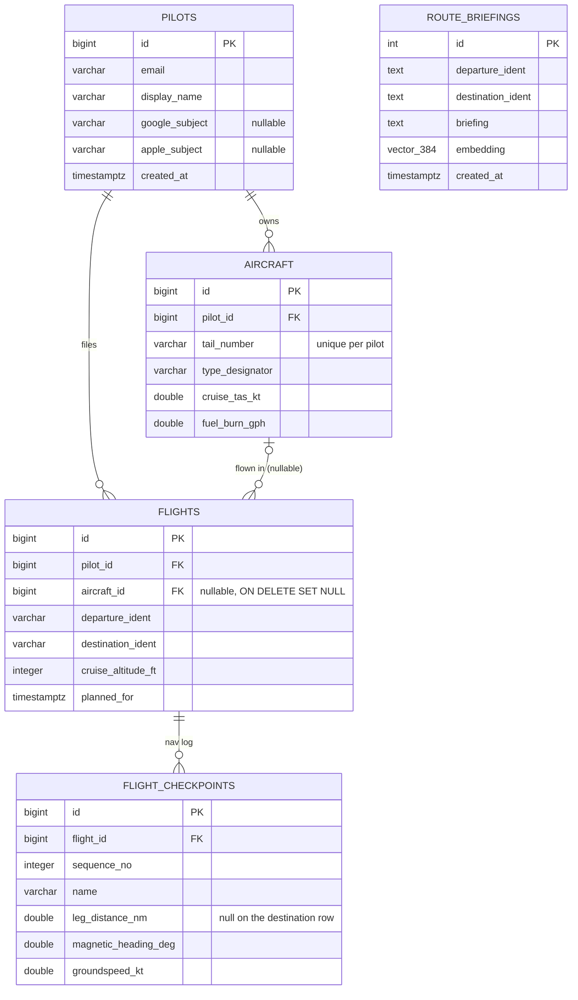

# VFR Nav Log Platform


## Contents

- **[Overview](#overview)** — [Highlights](#highlights) · [Architecture](#architecture) · [Tech stack](#tech-stack)
- **[Services & Data Design](#services--data-design)** — [Services in detail](#services-in-detail) · [Database & migrations](#database--migrations)
- **[AWS Target & Status](#aws-target--status)** — [Target architecture (AWS)](#target-architecture-aws) · [Status](#status)
- **[Developer Guide](#developer-guide)** — [Getting started](#getting-started) · [Where things live](#where-things-live) · [Notebooks](#notebooks) · [Testing & CI](#testing--ci)
- **[Appendix](#appendix)** — [Full service command reference](#full-service-command-reference) · [Repository layout, in full](#repository-layout-in-full) · [Notebooks, in full](#notebooks-in-full) · [CI, in full](#ci-in-full) · [Gotchas](#gotchas) · [See also](#see-also)

## Overview

An end-to-end system that generates VFR (Visual Flight Rules) flight nav
logs: a trained model selects visually identifiable ground checkpoints
along a route, a dead-reckoning engine computes headings, groundspeed, ETE,
and fuel burn from live weather, a rules engine recommends a legal cruising
altitude from terrain/airspace/weather constraints, and a Gen AI agent
assembles it all into a natural-language pilot briefing.

Route: Campbell Airport (C81, Grayslake, IL) → Duluth International
(KDLH, MN).

Built as a full-lifecycle platform engineering project — model training and
selection, orchestrated data pipelines, a microservices architecture, and a
Gen AI agent with long-term memory — designed from the outset with an
explicit path to production on AWS.

### Highlights

- **Checkpoints read off the chart itself.** A sectional is a
  cartographic product with a fixed palette, so water, watercourses,
  towns and linework come straight out of the tiles — no Overpass, no
  downloads, a few seconds for a 320 nm corridor. That matters beyond
  speed: the label being learned is "could a pilot spot this *on the
  chart*", so reading the chart makes the ground truth and the training
  signal the same thing rather than filtering an OSM extract down to
  approximate it.
- **Model selection across four frameworks.** Ridge regression, Random
  Forest, and Gradient Boosting (scikit-learn) benchmarked against PyTorch,
  TensorFlow/Keras, and Spark MLlib on the same feature set, with nested
  cross-validation and permutation importance for the sklearn baseline.
- **Orchestrated ML pipeline.** An Apache Airflow DAG automates data
  collection, feature engineering, training, evaluation, and model
  promotion — a new model only goes live if it beats the currently
  deployed one on held-out metrics.
- **Container architecture that mirrors its cloud target.** Compute is
  split along the same boundaries it will occupy on AWS: a
  Processing-Job-shaped container, a Training-Job-shaped container, and
  Airflow launching both as isolated, independently-versioned tasks — the
  same orchestration pattern used against managed services like SageMaker.
- **Domain-accurate flight planning.** Dead-reckoning leg calculations
  (wind correction angle, true/magnetic heading, groundspeed, ETE, fuel
  burn) built from FAA-standard formulas against live NOAA winds-aloft and
  magnetic-declination data. Cruising-altitude selection incorporates real
  terrain/obstacle clearance (FAA MEF methodology), live FAA Class B/C/D
  airspace shapefiles, and current METAR/TAF/SIGMET data. Only Class B
  constrains the cruising altitude: C and D need two-way radio
  communication established rather than a clearance, so they are reported
  as calls to make, not airspace to fly beneath.
- **A Gen AI agent with real memory.** A LangGraph agent, exposed as an MCP
  server, assembles the full nav log into a natural-language briefing, with
  long-term recall of past routes via a Postgres/pgvector semantic-search
  store — reusing existing infrastructure rather than standing up a
  separate vector database. Its MCP tools split the deterministic work
  from the one Claude call: an agent that connects with its own model
  can ask for the checkpoints, altitude and legs alone (`assemble_nav_log`,
  no Anthropic key spent) and write its own narrative, or ask for one
  written here (`generate_nav_log_briefing`) the way the webapp does.
- **The same agent task built twice, to compare frameworks.** A second
  implementation in CrewAI — identical tools, identical model-serving
  backend, identical Claude API — evaluates LangGraph's explicit
  state-graph control flow against CrewAI's agent-driven tool selection on
  the same real task this project runs end to end.
- **A concrete path to production**: every local service maps to a
  specific AWS target (SageMaker, ECS Fargate, RDS, CloudFormation) — see
  [Target Architecture](#target-architecture-aws).
- **CI on every push.** GitHub Actions runs the test suite and lint on
  every push/PR, then builds every service image and publishes it to GHCR
  (and to ECR, once AWS credentials are configured) from `main`.

### Architecture

The system runs today as ten Docker services:

| Service | Role |
|---|---|
| `webapp` | Spring Boot API — the public-facing route-planning service |
| `model-service` | FastAPI model-serving endpoint (`/ping`, `/invocations`) |
| `nav-log-agent` | LangGraph agent (MCP server) that assembles the full nav log and briefing |
| `crewai-agent` | The same task, built in CrewAI, for framework comparison |
| `db` | PostgreSQL + pgvector — application data and agent long-term memory |
| `airflow` | Orchestrates the ML training pipeline |
| `pipeline-processing` / `pipeline-training` | Data collection, feature engineering, and model training, run as isolated jobs |
| `ml` | Jupyter environment for model development and experimentation |
| `planning-service` | FastAPI server for the React app in `web/`: course, checkpoints, nav log, and rating spottability against FAA sectional charts |


<sub>Editable source: `architecture-current.drawio`. The rendered SVG has
the diagram embedded in it, so opening `architecture-current.svg` directly
in [draw.io](https://app.diagrams.net) (or the VS Code draw.io extension)
works too. AWS counterpart: `architecture-aws.drawio`, rendered in
[`README-AWS.md`](README-AWS.md).</sub>

### Tech stack

**ML / Data**


**Backend & orchestration**


**Front end**


**Gen AI**


**Infrastructure**


**Live data sources** (no logos, but they're where the domain accuracy
comes from): the FAA's own VFR Sectional tile service — which the
checkpoint detector reads directly — plus FAA NASR airport, navaid and
obstacle datasets, FAA Class B/C/D airspace shapefiles, NOAA aviation
weather (METARs, TAFs and SIGMETs from aviationweather.gov's cache
files, refreshed every few minutes, rather than a query per route),
the magnetic-declination model, and OpenStreetMap via the Overpass API
for the tabular feature pipeline.

## Services & Data Design

### Services in detail

**`planning-service`** — chart vision, checkpoint selection and the nav
log. Serves no pages: the front end lives in [`web/`](../web) and is built
into `webapp`'s jar, which proxies here for every computation. Publishes no
port on AWS either — it sits behind `webapp` in a private subnet, found by
service discovery at `planning-service.vfr-route.internal`.

- `/api/course`, `/api/checkpoints`, `/api/navlog`, `/api/detect/stream`,
  `/api/picks`, `/api/sectional-tile`, `/api/tac-tile` — reached by the
  browser as `/api/planner/*` on `webapp`, never directly. The two tile
  endpoints render the FAA's own chart GeoTIFFs (`vfr.charts`, one
  download per sheet per 56-day cycle into `data/raw/charts/`), so the
  map depends on no hosted chart service. Its own OpenAPI page is at
  [`localhost:8084/docs`](http://localhost:8084/docs); the full endpoint
  list is in [`planning-service/README.md`](../planning-service/README.md)
- `/api/briefing` — the FAA-sequence weather briefing behind the
  briefing on `/app/plan`, the flight planning drawer (the
  narrative itself comes through `webapp`'s own `/api/comparison`,
  below)
- `/api/model-comparison` — every trained algorithm's accuracy side by
  side: the dev console charts it, and Plan's info popover names the
  promoted one from it
- `/api/status`, `/api/retrain`, `/api/aircraft-profiles` — the Dev
  drawer's own snapshot of the stack (services, FAA and weather data
  freshness, the model registry, collected corridors and their labels),
  a retrain run through Airflow, and the stock aircraft profiles the nav
  log's aircraft picker offers
- `/api/altitude-breakdown` — the full reasoning behind a recommended
  cruise altitude for any route; the nav log works the same floor and
  ceiling out leg by leg (a Class B shelf caps only the legs under it)
  and offers three plans of the legal altitudes -- the lowest, the
  highest, and the fastest for the winds aloft, every climb flown on
  the leg that makes it, none above 12,500 ft without oxygen -- and
  the nav log header's own "why" popover and the briefing's "Cruise
  Altitude" section walk the pilot through it, step by step. A
  departure time picks the winds forecast period, gives every row an
  ETA, and sets the fuel reserve (day or night, by civil twilight at
  either end) the totals hold the aeroplane's usable fuel against
- `vfr.chartvision` reads the corridor's tiles and segments them by the
  chart's own palette, streaming results block by block from the departure
  end. `vfr.chartlabels` stores what a pilot decides about them, keyed by
  route and position rather than by an OSM id
- Collection for an uncollected corridor runs here, in-process on a
  background thread, rather than by launching a pipeline container — that
  would mean handing this service the Docker socket, a far larger grant
  than it needs

**`model-service`** — FastAPI model-serving endpoint.

- `/ping` (health) and `/invocations` (inference) — matches the SageMaker serving container contract
- Real inference against whichever model `/invocations` is asked for: the
  promoted model by default (loaded from `/opt/ml/model`, SageMaker's own
  path, bind-mounted from `data/models/current`), or explicitly one of the
  PyTorch/TensorFlow/Spark candidates `vfr.model_candidates` trained
  (`data/models/candidates/<algo>`) — the planner only ever asks for the
  promoted one; the Dev ML comparison shows how the rest measured up.
  A promotion (the pipeline's, or the Dev console's retrain) writes new
  files into that directory, and the service notices their timestamps
  on its next request and serves the new model without a restart
- Serves whichever precomputed feature stores exist in `FEATURES_DIR`, keyed by
  route; an uncollected corridor returns 404 carrying the two commands that build
  it, since collection is a batch job rather than an inference call
- Interactive API docs (a FastAPI default) at `http://localhost:8000/docs`, raw spec at `/openapi.json`

**`springboot-app` (webapp)** — the public-facing route-planning API.

- Schema owned by Flyway migrations; JPA's `ddl-auto` only validates against them
- Actuator health probes at `/actuator/health/liveness` and `/actuator/health/readiness`
- Bean Validation on request bodies (`AircraftRequest`, `SaveFlightRequest`) + a global exception handler turn a bad request into a clean `400`, a wrong method into `405` and a duplicate tail number into `409`, not an opaque `500`
- Never calls `model-service` itself: scoring belongs to `planning-service`, which it proxies (`/api/planner/*`). Reads through that proxy are public; writes (checkpoint notes, corridor builds) need a session as soon as the deployment offers a way to sign in (OIDC credentials or a mail host), and the developer's work (picks, a retrain, a chart refresh, the stack's status and services) needs the developer role as well. All of it stays open locally where neither is set
- Sign-in with Google or Apple (OIDC), or a passwordless email magic
  link — OIDC is inactive by default; activate with the `oauth` Spring
  profile once `GOOGLE_CLIENT_ID`/`GOOGLE_CLIENT_SECRET` or all four
  `APPLE_*` vars are set (client registration itself is built in Java,
  `security/OAuthClientsConfig.java`, since Apple's client secret is a
  signed, expiring JWT no static YAML value could hold). The magic
  link (`/api/auth/magic-link`) needs no profile and works whether or
  not OIDC is configured, though sending needs a real `MAIL_HOST` too.
  `/api/me` reports who's signed in; `/api/aircraft` and `/api/flights`
  are that pilot's own aeroplanes and filed flights, each pilot-scoped
  so one can never read or edit another's by guessing an id
- `/api/comparison` (`ComparisonProxyController`) — streams a narrative
  for the nav log the briefing shows, from `nav-log-agent`'s LangGraph
  build (`framework=langgraph`) or `crewai-agent`'s CrewAI build
  (`framework=crewai`), each a real billed Claude call, as
  newline-delimited JSON while Claude writes it. Needs a session
  wherever anyone can sign in. Neither agent is
  required for `webapp` itself to start
- Interactive API docs (springdoc-openapi) at `http://localhost:8080/swagger-ui/index.html`, raw spec at `/v3/api-docs`

**`nav-log-agent`** — a LangGraph agent wrapped as an MCP server.

- Three MCP tools: `assemble_nav_log` and `remember_briefing` (no Anthropic key needed) and `generate_nav_log_briefing`, each taking `departure_ident`, `destination_ident`, and optionally `altitude_ft` and `aircraft_name` (the planner's own choice and default aeroplane when omitted)
- Graph: `fetch_nav_log` (planning-service's `/api/plan`, through `vfr.planner_client`) → `retrieve_memory` (pgvector, embedded locally with `sentence-transformers/all-MiniLM-L6-v2`, baked into the image) → `generate_briefing` (Claude API, streamed) → `store_memory`. The briefing on Plan, which already has the nav log, POSTs it to `/compare` and the graph starts at `retrieve_memory`
- Served over SSE at `/mcp/sse`
- The nav log it briefs is the planner's own -- the checkpoints, per-leg altitudes, climbs and fuel check a pilot sees -- rather than one it assembles, so the two cannot drift apart

**`crewai-agent`** — the identical task (checkpoints → altitude → legs → briefing), built in CrewAI instead of LangGraph, for framework comparison.

- The same planner answers as `nav-log-agent` (`vfr.planner_client`); different control-flow model — an `Agent` reasoning over `tools` rather than an explicit function sequence
- Run by hand as a one-shot CLI (`python -m app.main`); `docker compose up` runs a thin HTTP wrapper around the same crew so the briefing on Plan can call it
- No pgvector memory store of its own

### Database & migrations

Two independent schemas on the same `db` Postgres container, each owned by
its service and managed by versioned SQL migrations rather than an ORM
auto-generating schema from code:



- **`webapp`** (`pilots`/`aircraft`/`flights`/`flight_checkpoints`)
  — Flyway. One pilot's own data, populated once they sign in (see
  [Services in detail](#services-in-detail)) — `aircraft_id` on
  `flights` is nullable and `ON DELETE SET NULL` rather than `CASCADE`,
  since a flown flight is a record that must survive selling the
  aeroplane. Scored corridors are not persisted here at all: they come
  from `planning-service` on demand and are the same for everyone. Add
  a migration as
  `springboot-app/src/main/resources/db/migration/V<N>__description.sql`
  and it runs automatically on next startup. `ddl-auto` is `validate`, so
  drift between the JPA entities and the actual schema fails loudly at
  startup instead of silently altering a table.
- **`nav-log-agent`** (`route_briefings`) — a minimal versioned-SQL runner
  (`app/migrations.py`), no ORM. Add a file as
  `app/migrations/V<N>__description.sql`; `ensure_schema()` (called at
  agent startup) tracks applied versions and runs any new ones in order.

## AWS Target & Status

### Target architecture (AWS)

Every local service maps to a specific, already-written AWS resource —
see [`README-AWS.md`](README-AWS.md) for the full diagram walkthrough, the
CloudFormation/Lambda reference, and the deploy runbook.

| Local component | AWS target |
|---|---|
| `webapp` | ECS Fargate |
| `nav-log-agent` | ECS Fargate, behind the same ALB (`/mcp/*`) |
| `crewai-agent` | ECS Fargate task definition, run on demand |
| `db` | RDS PostgreSQL |
| `model-service` | SageMaker Endpoint |
| `airflow` | ECS Fargate (self-hosted), EFS-backed metadata |
| `pipeline-processing` / `pipeline-training` | SageMaker Processing/Training Jobs |
| Model evaluation/promotion | SageMaker Model Registry pattern |
| `ml` | SageMaker Studio, used ad hoc for development work |
| CI/CD | GitHub Actions → GHCR + ECR |

### Status

The ML pipeline, orchestration layer, dead-reckoning engine, altitude
selection logic, both Gen AI agents, and CI are built, integrated, and
working end to end. The AWS side is fully written and validated
(`cfn-lint` clean, every image builds, the AWS-mode DAG parses correctly)
— see [`README-AWS.md`](README-AWS.md). Three things remain, and none is
an engineering gap:

- **Ratings for the chart-vision detector.** The tabular pipeline is
  finished: all 206 OSM-derived candidates on C81→KDLH are labeled, and a
  RandomForest is trained, promoted and served. The chart-vision detector
  that replaced it has no scorer yet, and this has now been measured
  rather than assumed. `vfr.chartfeatures` and `vfr.chartlabels_join`
  build the feature table and bootstrap a training set by carrying the
  older OSM ratings onto chart detections by position; 77 of them land.
  On those 77, **no model beats predicting the mean** (MAE 0.804), and
  the palette's hand-set constants are already level with it (0.810),
  while Ridge, RandomForest and GradientBoosting all come out worse.
  The other direction does work, and the tabular model now uses it:
  each rated chart pick labels the OSM candidate it lands on
  (`vfr.pipeline._load_labeled`), and retrain and promotion score the
  new model and the promoted one on the same fixed holdout.

  The cause is the target, not the features. 79% of the labels are 4 or 5
  and 3% are 0 or 1, because they were made by clicking points worth
  using; every category's ratings span nearly the full scale (river 4.40,
  water 4.27, town 4.00, road_or_rail 3.67), so there is no separation to
  find. The models' strongest feature was distance from the course line —
  where the cursor went, not what the landmark is, which is the same
  leakage that removed route position from the tabular model.

  So rating a detection `0` is the judgment the detector most needs and
  the one the data has none of, and a labeling pass over C81→KDLH at
  `docker compose up webapp` and
  [`/app/dev`](http://localhost:8080/app/dev) is the next step — this time deliberately rating poor landmarks as poor. Until the
  target has spread, the palette constants are the better scorer and the
  honest one.

  Three things unblock together once it exists. The detector's recall is
  measurable (it currently supplies under 40% of the waypoints a pilot
  actually wants on that route). The planner can drop its collection step
  and plan any corridor, instead of 404ing on one it has not built.
  And `vfr.osm` — still load-bearing today, since `pipeline.collect()`
  feeds the planner, the DAG and the feature stores — can come out.

- **A second route.** Every label so far comes from one corridor, so
  nothing yet proves the model transfers. Route position was dropped from
  the feature set for exactly this reason (see `FEATURE_COLS_BASE`):
  measured over 25-fold repeated CV, a model given *only* where a point
  sat along the route recovered 78% of the full model's gain over a
  predict-the-mean baseline, which is a route being memorised rather than
  spottability being learned.
- **A live AWS deployment.** No AWS account exists in this project's
  environment. Everything that can be verified without one — template
  validity, image builds, DAG correctness — has been; an actual
  `aws cloudformation deploy` is the only remaining step.

## Developer Guide

### Getting started

**Prerequisites:**

- **Docker Desktop** with Docker Compose v2. This project is Docker-only —
  there is no native Python virtualenv.
- **Git.**
- **An Anthropic API key** (`ANTHROPIC_API_KEY`) — only required to run
  `nav-log-agent` or `crewai-agent`, which are the two services behind the
  `ai` Compose profile. Everything else works without one, including every
  `docker compose` command: the key is read with `:-`, not `:?`, precisely
  so that a missing key cannot fail a command that was never going to call
  an LLM. (`planning-service` also calls Claude, for the optional "how to
  spot it" checkpoint notes; without a key that one endpoint returns an
  error and the rest of the planner is unaffected.)
- **AWS CLI + credentials** — only required for an actual AWS deploy; local
  development works without them. See [`README-AWS.md`](README-AWS.md).

**First-time setup:**

```bash
git clone <repo-url>
cd flight_plan

# Only needed for nav-log-agent / crewai-agent:
export ANTHROPIC_API_KEY=sk-...
# or put it in a .env file (gitignored) at the repo root — docker compose
# reads .env automatically.
```

Nothing else to install natively; every service builds its own image.

**Repository layout:**

```
data/             raw/processed/labels/aircraft/models — see Appendix for detail
notebooks/        numbered, run-in-order exploratory notebooks (01-08)
src/vfr/          shared Python package — pipeline.py, model_registry.py, navlog.py, altitude.py, etc.
airflow/dags/     the vfr_pipeline DAG (local) and vfr_pipeline_aws_dag.py (AWS, see README-AWS.md)
docker/           Dockerfiles + requirements for ml / pipeline-processing / pipeline-training / airflow
                  (each including vfr's own list, src/requirements.txt)
model-service/    FastAPI model-serving app (/ping, /invocations)
springboot-app/   Spring Boot API (webapp) — routes, DB, calls model-service
nav-log-agent/    LangGraph agent (MCP server) — assembles the full nav log + briefing
crewai-agent/     the same task, built in CrewAI, for framework comparison
infra/            CloudFormation template + Go Lambda for the AWS target architecture
tests/            pytest suite for src/vfr
docs/             this file, README-AWS.md, LEARNING-GUIDE.md, architecture diagrams
```

**Running the stack:** each service is a `docker-compose.yml` entry —
bring up only what you need. Full command reference is in the
[Appendix](#appendix); the essentials:

```bash
docker compose up webapp                           # UI + API at :8080; brings up db, model-service, planning-service
docker compose up ml                               # Jupyter at :8888 (token "vfr")
docker compose up airflow                          # DAG UI at :8081
docker compose up nav-log-agent                    # MCP server at :8082
docker compose run --rm crewai-agent python -m app.main \
  --departure-ident C81 --destination-ident KDLH   # one-shot CLI
```

**On a phone, on the same Wi-Fi:** the webapp's ports are on this
machine's loopback by default, because with no sign-in configured every
planner write is open to whoever can reach them. `docker-compose.phone.yml`
publishes webapp alone on every interface, for as long as you are
testing on a network you trust. `http://<your Mac's address>:8080/app/plan`
then works for planning, but the two things a pilot wants in the air --
their own position on the chart, and the route's charts with no
connection -- the browser grants only to a secure origin. So the webapp
also listens on HTTPS, with HTTP/2, once it has a certificate:

```bash
infra/local-https/make-certs.sh 192.168.1.42   # your Mac's LAN address; writes infra/local-https/certs/
docker compose -f docker-compose.yml -f docker-compose.phone.yml up -d webapp
                                               # now also https://192.168.1.42:8443
```

Install `certs/ca.pem` on the phone once (the script prints the steps
for iPhone and Android), then open `https://<address>:8443/app/plan`.
From there the map's info popover offers **Show my position** (the GPS as
a blue arrow, and the map kept on it until you pan) and **Keep this
route's charts on this device** (every sectional tile within 10 nm of
the course, whole-route view to full detail, held by the app's service
worker along with the course, checkpoints and nav log, so the route
opens again with the network off). The briefing and the airports'
weather are not kept: a cached METAR could only ever be shown as if it
were current, so with no network they say the weather could not be
checked. Add the page to the home
screen and it opens as an app. On AWS the load balancer terminates TLS
and all of this simply works at the site's own address.

### Where things live

Every address the running stack answers on, verified against a live
stack. Anything not listed here does not exist.

| What | URL | Needs |
|---|---|---|
| **Route planner** — the map with the flight planning drawer beside it: the nav log, walked with the arrow keys or a click, and under it the FAA-sequence briefing with its LangGraph/CrewAI narrative popover and Print. Also the app's homepage, bare `/app` redirects here | [`localhost:8080/app/plan`](http://localhost:8080/app/plan) | `webapp` + `planning-service` |
| **Dev** — the developer's page: the labeling page above, with the developer's console (model registry and retrain, corridors and their labels, service and data status) in a drawer over the chart. `/app/label` and `/app/settings` redirect to Dev and Plan | [`localhost:8080/app/dev`](http://localhost:8080/app/dev) | `webapp` + `planning-service` |
| Spring Boot API docs | [`localhost:8080/swagger-ui/index.html`](http://localhost:8080/swagger-ui/index.html) | `webapp` |
| Spring Boot OpenAPI spec | [`localhost:8080/v3/api-docs`](http://localhost:8080/v3/api-docs) | `webapp` |
| Health / readiness | [`localhost:8080/actuator/health`](http://localhost:8080/actuator/health) | `webapp` |
| Planning + chart-vision API docs | [`localhost:8084/docs`](http://localhost:8084/docs) | `planning-service` |
| Model-serving API docs | [`localhost:8000/docs`](http://localhost:8000/docs) | `model-service` |
| Airflow DAG UI | [`localhost:8081`](http://localhost:8081) | `airflow` |
| Jupyter | [`localhost:8888`](http://localhost:8888) (token `vfr`) | `ml` |

All three pages are served by `webapp`, not by `planning-service`: the
React app in [`web/`](../web) is built into the Spring Boot jar, and the
browser reaches the Python service only through `webapp`'s
`/api/planner/*` proxy. `docker compose up webapp` starts
`planning-service` with it. Hitting port 8084 directly works and is
useful when debugging, but nothing in the front end does it.

A request crosses four services, each with one job:

```
browser (web/)   the map, the keyboard, the rows
  -> webapp        :8080  serves the page, proxies /api/planner/*, owns auth and the database
  -> planning-service    :8084  reads sectional tiles, great-circle geometry, checkpoint selection, nav log
  -> model-service :8000  scores candidates (/invocations, SageMaker's contract)
  -> db            :5432  pilots, flights, agent memory
```

`planning-service` is a *client* of `model-service`, not a version of it — it
calls `/invocations` when it needs a score. And despite its name it serves
no pages; see [Services in detail](#services-in-detail).

### Notebooks

Notebooks 01-03 are the manual version of what `pipeline.py` automates;
04-08 are standalone comparison/domain exercises. Run them via `docker
compose up ml`. Full per-notebook breakdown is in the
[Appendix](#appendix).

### Testing & CI

```bash
# Python (src/vfr). The pipeline images carry no test tooling -- this
# runs what CI runs, from requirements-dev.txt.
# libexpat1 is the one system library rasterio's wheel needs that the
# slim image leaves out.
docker run --rm -v "$PWD":/w -w /w -e PYTHONPATH=/w/src python:3.13-slim \
  sh -c "apt-get update -qq && apt-get install -y -qq libexpat1 && pip install -q -r requirements-dev.txt && ruff check src/vfr tests && pytest tests/ -q"

# planning-service (its own FastAPI-layer suite, separate from the one
# above since it needs the service's own requirements on top of pytest)
docker run --rm -v "$PWD":/w -w /w/planning-service python:3.13-slim \
  sh -c "pip install -q -r requirements-dev.txt && ruff check app tests && pytest tests/ -q"

# model-service, nav-log-agent and crewai-agent: the same shape, each
# from its own directory and requirements-dev.txt. nav-log-agent wants
# the CPU torch wheel first (`pip install torch --index-url
# https://download.pytorch.org/whl/cpu`), as its Dockerfile does.
docker run --rm -v "$PWD":/w -w /w/model-service python:3.13-slim \
  sh -c "pip install -q -r requirements-dev.txt && ruff check app tests && pytest tests/ -q"

# Web front end (web/): typecheck plus unit tests. No browser needed:
# the filters, ordering, rating and nav-log rules are pure functions.
docker run --rm -v "$PWD":/w -w /w/web node:26-slim \
  sh -c "npm ci && npm run types && npx tsc --noEmit && npx vitest run"

# Java (webapp). No native Maven needed, matching the rest of this
# project; the Docker socket is mounted through so Testcontainers can
# start its Postgres as a sibling container.
docker run --rm -v "$PWD/springboot-app":/build -w /build \
  -v /var/run/docker.sock:/var/run/docker.sock \
  --add-host=host.docker.internal:host-gateway \
  -e TESTCONTAINERS_HOST_OVERRIDE=host.docker.internal \
  maven:3.9.16-eclipse-temurin-25 mvn -B test
```

(CI runs `mvn test` directly instead — a GitHub runner has Maven and a
local Docker daemon, so it needs none of the socket/host plumbing above.)

Six suites, split by what each can actually prove:

- **`tests/`** (pytest) — the pure-logic parts of `src/vfr`: geo math,
  engineered features, dead-reckoning, the model registry, the
  remote-URI guards, plus (mocked, no live network) `vfr.weather`'s
  METAR parsing and `vfr.airports`' runway/frequency lookups.
- **`planning-service/tests/`** (pytest, its own suite) — the HTTP
  contract for the endpoints with no coverage anywhere else
  (`/api/model-comparison`, `/api/checkpoints`' error translation,
  `/api/altitude-breakdown`): status codes, response shape, and that a
  `WeatherServiceError` anywhere underneath reaches the caller as a
  clean `502`, not a raw `500`; plus that the committed `openapi.json`
  (which `web/` generates its API types from) matches the app.
- **`model-service/tests/`** (pytest) — `/ping`, `/invocations` and the
  reload of a newly promoted model, against real joblib and parquet
  files in a temporary directory.
- **`nav-log-agent/tests/`** and **`crewai-agent/tests/`** (pytest) — the
  agents' own logic with the database, planning-service and Claude
  mocked: what goes into the briefing prompt, that a failed narration is
  never stored as precedent, and that a request missing its legs is
  refused before any crew is built.
- **`springboot-app/src/test/`** (JUnit) — that the committed
  `springboot-app/openapi.json`, which `web/` generates its types for
  this app's endpoints from, is the document the app serves
  (`OpenApiDocumentTest`; regenerate with `WRITE_OPENAPI=1`); the HTTP contract via
  `@WebMvcTest` (validation `400`s, `405` for a wrong method, the `409`
  on a duplicate tail number), Mockito-backed
  service tests for the pilot-scoping guards (`AircraftServiceTest`,
  `FlightServiceTest`), the DTO→entity conversion, and a
  Testcontainers-backed test that boots a real Postgres to verify
  Flyway's migrations apply and that `ddl-auto: validate` accepts the
  JPA entities against the resulting schema — so entity/schema drift
  fails CI rather than a deploy.

Deliberately left to manual verification: anything needing live network
calls or a trained model (`collect`, `engineer_features`, `retrain`,
`vfr.altitude`, `vfr.airspace`) — mocking those would test the mock, not
the upstream data contract that actually breaks.

`.github/workflows/ci.yml` runs every suite on every push/PR. Full
CI job breakdown is in the [Appendix](#appendix).

## Appendix

### Full service command reference

| Command | What it does | Port |
|---|---|---|
| `docker compose up db` | PostgreSQL + pgvector | `5432` |
| `docker compose up model-service` | FastAPI model serving; needs a promoted model | `8000` |
| `docker compose up webapp` | Spring Boot API and the three browser pages; brings up `db`, `model-service` and `planning-service` too | `8080` |
| `docker compose up ml` | Jupyter, for notebooks 01-08 | `8888` (token `vfr`) |
| `docker compose run --rm pipeline-processing collect` | Runs `pipeline.collect()` | — |
| `docker compose run --rm pipeline-processing engineer-features` | Runs `pipeline.engineer_features()` | — |
| `docker compose run --rm pipeline-training retrain` | Runs `pipeline.retrain()` | — |
| `docker compose run --rm pipeline-training python -m vfr.model_registry evaluate` | Runs `evaluate`/`promote` | — |
| `docker compose up airflow` | Orchestrates the full pipeline as a DAG | `8081` |
| `docker compose up nav-log-agent` | LangGraph MCP server (needs `ANTHROPIC_API_KEY`) | `8082` |
| `docker compose run --rm crewai-agent python -m app.main --departure-ident C81 --destination-ident KDLH` | One-shot CrewAI CLI (needs `ANTHROPIC_API_KEY`) | — |
| `docker compose up planning-service` | Planning + chart-vision API; `webapp` proxies to it and starts it | `8084` |

Notes:

- `pipeline-processing`/`pipeline-training` are separate images on purpose
  — they mirror the AWS Processing-Job/Training-Job split. They are jobs,
  not services, behind the `pipeline` profile: a plain `docker compose up`
  leaves them out (the training image's default command is a full
  retrain), and naming one in `run` or `build` works as it always did.
- `airflow`'s DAG launches Collect/Feature-Engineer/Retrain as sibling
  containers via `DockerOperator`; build them first
  (`docker compose build pipeline-processing pipeline-training`).
- `nav-log-agent`/`crewai-agent` are behind the `ai` profile, so a plain
  `docker compose up` leaves them out. Start them with
  `docker compose --profile ai up -d`, or by naming one
  (`docker compose up -d nav-log-agent`), which enables its profile.
- `nav-log-agent` needs `NAV_LOG_AGENT_API_KEY` (its own bearer token,
  any string — unset, it exits saying it "refuses to start
  unauthenticated") but **not** an Anthropic key: its MCP tools compute
  the nav log and leave the narrative to the agent that connected. Only
  `generate_nav_log_briefing` and the flight planning drawer's streamed narrative
  spend Anthropic credit. `crewai-agent` needs a key for everything.
- Full port list: `webapp` 8080, `model-service` 8000, `db` 5432
  (`vfr`/`vfr`/`vfr_route`), `airflow` 8081, `nav-log-agent` 8082,
  `planning-service` 8084, `ml` 8888. Addresses are in
  [Where things live](#where-things-live).

### Repository layout, in full

```
data/
  raw/            downloaded OSM/FAA/elevation/magnetic-variation data and the
                  chart tile cache (gitignored, regenerable)
  processed/      cleaned feature tables
  labels/         hand-labeled spottability ratings — chart_picks.csv is the
                  current one, rated on the chart itself
  aircraft/       aircraft performance profiles (c172.json, etc.)
  models/         trained model artifacts (candidate/, current/, versions/<timestamp>/)
```

### Notebooks, in full

| # | Notebook | What it does | Automated as |
|---|---|---|---|
| 01 | `data_collection` | Pulls candidate checkpoints along the route corridor (OSM + FAA NASR) | `pipeline.collect` |
| 02 | `feature_engineering` | Builds the model feature table | `pipeline.engineer_features` |
| 03 | `sklearn_baseline` | Hand-labeling + Ridge/RandomForest/GradientBoosting selection, nested CV | `pipeline.retrain` |
| 04 | `pytorch_tensorflow` | PyTorch + Keras MLP vs. the sklearn baseline | Comparison only |
| 05 | `huggingface_embeddings` | Sentence-transformer embeddings as engineered features | Comparison only |
| 06 | `spark_mllib` | Spark MLlib GBTRegressor, same comparison | Comparison only |
| 08 | `altitude_selection` | Terrain/obstacle floor, Class B/C/D airspace, weather, aircraft ceiling → recommended cruise altitude | `vfr.altitude` |

(There is no 07.)

### CI, in full

`.github/workflows/ci.yml` — eleven jobs, on push to `main`, on every
pull request, and by hand (`workflow_dispatch`, the Actions tab's own
"Run workflow" button) — added after a run failed at the platform
level (a runner that never started; every job completed in about two
seconds with no steps executed) and the only way to ask again was an
empty commit:

| Job | What it does |
|---|---|
| `test` | ruff + pytest over `src/vfr` |
| `changes` | A path filter (`dorny/paths-filter`) telling both `build-images` and `docs` which service images a change could have touched. Runs on pull requests (where `build-images` uses it to build only the touched images) and on pushes to `main` (where `build-images` ignores it on purpose — main's images stay fully in sync with every dependency bump — but `docs` uses it to skip the three heavy `pdoc` steps below when nothing they document changed). |
| `test-web` | `tsc --noEmit`, `vitest` and a production build over `web/` — filters, ordering, what counts as rated, and which leg leaves a checkpoint, all pure functions needing no browser |
| `test-webapp` | `mvn test` — webapp's JUnit suite, including the Testcontainers Postgres test |
| `test-planning-service` | ruff + pytest over `planning-service/tests/` — its own dependency set (`planning-service/requirements-dev.txt`), separate from `test`'s unrelated `src/vfr` ones |
| `test-model-service` | ruff + pytest over `model-service/tests/`, on the service's own requirements (torch and tensorflow included) |
| `test-nav-log-agent` / `test-crewai-agent` | ruff + pytest over each agent's `tests/`, on that agent's own requirements; the database, planning-service and Claude are mocked, so nothing is billed |
| `docs` | Regenerates Javadoc + godoc on every push/PR. The three `pdoc` steps -- which each build one of this repo's heavy ML images (torch/tensorflow/Spark) purely so `pdoc` can import the modules inside -- run only on pushes to `main`, and only for whichever of `src/vfr`, `nav-log-agent` or `crewai-agent` `changes` says actually changed; a push that only touched `web/` skips all three rather than paying six figures of milliseconds to rebuild and re-document code nobody edited. Output uploads as a `documentation` artifact. |
| `build-images` | Builds every service Dockerfile, publishes each to GHCR on push to `main`. For every image that runs Python code of this repo's, it first imports what that service's own code imports *inside the built image* (`import app.main`, `import vfr.pipeline, …`) and publishes only if that works -- the check that would have caught 2026-09-22's missing `pyproj` in four images |
| `push-ecr` | Pushes the six images the CloudFormation stack deploys (`webapp`, `planning-service`, `model-service`, `nav-log-agent`, `crewai-agent`, `airflow`) to ECR via OIDC, reusing `build-images`' cache; activates automatically once `AWS_ROLE_ARN`/`AWS_REGION` repo variables exist |

`build-images` gates on the test jobs, so a failing test never produces a
published image. A cold run (every cache empty, every path filter
saying "changed") takes about six minutes; a push that only touches one
service is under two.

### Gotchas

Non-obvious things worth knowing up front:

- **`Path("s3://bucket/x")` silently collapses to `"s3:/bucket/x"`**
  under `pathlib` normalization. Code rejecting a remote URI must check
  the raw string for `"://"` *before* wrapping it in `Path(...)`. See
  `_reject_remote_uri()` in `src/vfr/pipeline.py`/`model_registry.py`.
- **`docker compose up <service>` reuses a stale container** if the image
  was rebuilt but the container wasn't recreated. Use
  `docker compose up -d --force-recreate <service>`.
- **`DockerOperator` in Airflow resolves volume mounts against the host's
  filesystem**, outside the `airflow` container's own view of it.
  `PROJECT_HOST_PATH` (`docker-compose.yml`) supplies the host's real path.
- **`aws-lambda-go` v1.55.0+ requires a newer Go toolchain than
  `golang:1.25-alpine` ships.** `infra/lambda-retrain-trigger/go.mod` pins
  `v1.47.0` deliberately.
- **`crewai` needs the `anthropic` extra installed explicitly**
  (`crewai[anthropic]`) — plain `crewai` raises `ImportError` the moment
  an `Agent` with `llm="anthropic/<model>"` is constructed.
- **An MCP server library's SSE transport defaults to binding
  `127.0.0.1`**, unreachable from outside its own container — Docker's
  port mapping and an ALB target group both need `host="0.0.0.0"` passed
  explicitly (`nav-log-agent/app/main.py`).
- **A Maven `pom.xml` XML comment containing a literal `--`** breaks
  Maven's POM parser with an opaque `Non-parseable POM` error.
- **Recent numpy/pandas/scipy/pyarrow wheels have dropped Intel-macOS
  support**, one reason this project runs entirely in Docker.
- **`data/raw/` (~600MB) must stay in `.dockerignore`** — these services
  mount the project directory at runtime, well after any build step.
- **A repo checked out under an iCloud-synced folder (`~/Desktop`,
  `~/Documents`) accumulates conflict copies**, named `<file> 2.<ext>`
  or `<file> 3.<ext>` beside the original, whenever two processes (or a
  disk-full write racing a sync) touch the same file. Seen for real in
  `springboot-app/target` (breaks Flyway's migration versioning),
  `data/raw` (an airport CSV, and once the whole pickled Class B
  airspace cache — the real filename ends up absent, the conflict copy
  holds the actual data), and `web/src` (a stale duplicate of a
  component, imported by nothing, silently out of date). None of them
  are a code problem; deleting the conflict copy and, for a derived
  cache, letting the code regenerate the real file is always the fix.
  A service that was already running when the corruption happened may
  need restarting even after the file is fixed — a lock or an
  in-process cache can stay wedged on stale state that a fresh process
  wouldn't have. `.gitignore`'s `* [0-9].*` catches the web-source case
  so one can never be committed by accident; it cannot stop them from
  appearing on disk in the first place.

### See also

| Doc | Read it when you want to... |
|---|---|
| [`README-AWS.md`](README-AWS.md) | See the target architecture diagram box by box, and deploy it. |
| [`LEARNING-GUIDE.md`](LEARNING-GUIDE.md) | Understand *why* it's built this way, concept by concept, well enough to build something like it yourself. |
