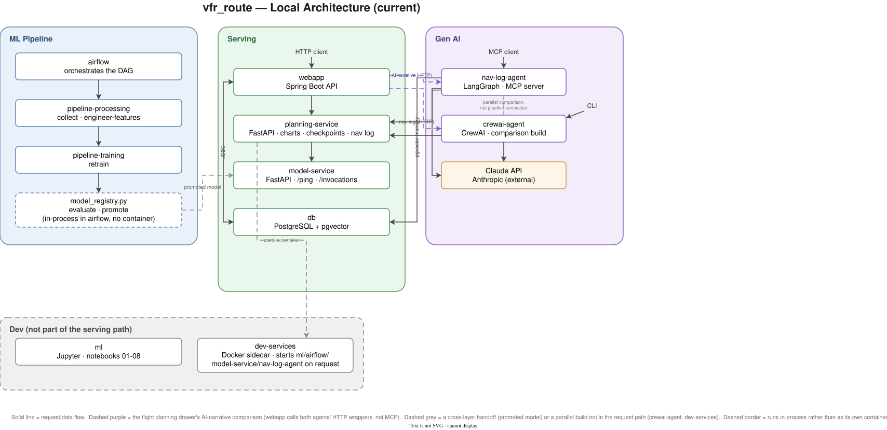
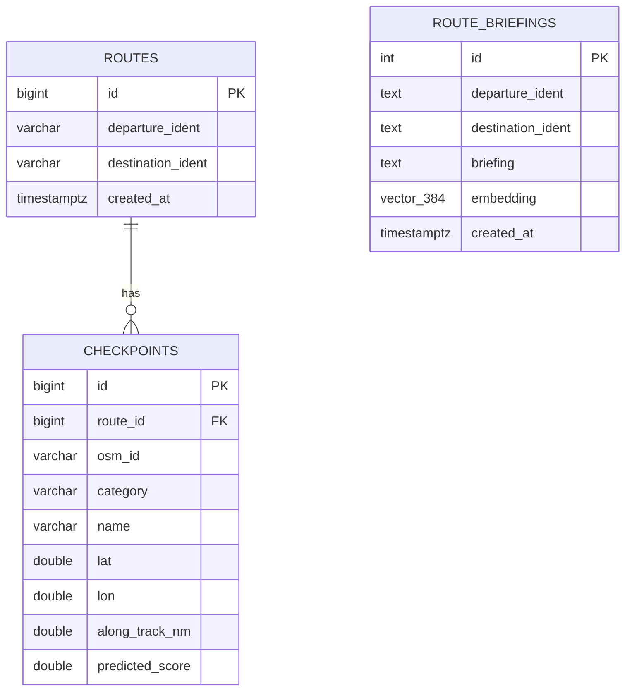

# VFR Nav Log Platform


## Contents

- **[Overview](#overview)** — [Highlights](#highlights) · [Architecture](#architecture) · [Tech stack](#tech-stack)
- **[Services & Data Design](#services--data-design)** — [Services in detail](#services-in-detail) · [Database & migrations](#database--migrations)
- **[AWS Target & Status](#aws-target--status)** — [Target architecture (AWS)](#target-architecture-aws) · [Status](#status)
- **[Developer Guide](#developer-guide)** — [Getting started](#getting-started) · [Notebooks](#notebooks) · [Testing & CI](#testing--ci)
- **[Appendix](#appendix)** — [Full service command reference](#full-service-command-reference) · [Repository layout, in full](#repository-layout-in-full) · [Notebooks, in full](#notebooks-in-full) · [CI, in full](#ci-in-full) · [Gotchas](#gotchas) · [See also](#see-also)

## Overview

An end-to-end system that generates VFR (Visual Flight Rules) flight nav
logs: a trained model selects visually identifiable ground checkpoints
along a route, a dead-reckoning engine computes headings, groundspeed, ETE,
and fuel burn from live weather, a rules engine recommends a legal cruising
altitude from terrain/airspace/weather constraints, and a Gen AI agent
assembles it all into a natural-language pilot briefing.

Route: Campbell Airport (C81, Grayslake, IL) → Duluth International
(KDLH, MN).

Built as a full-lifecycle platform engineering project — model training and
selection, orchestrated data pipelines, a microservices architecture, and a
Gen AI agent with long-term memory — designed from the outset with an
explicit path to production on AWS.

### Highlights

- **Model selection across four frameworks.** Ridge regression, Random
  Forest, and Gradient Boosting (scikit-learn) benchmarked against PyTorch,
  TensorFlow/Keras, and Spark MLlib on the same feature set, with nested
  cross-validation and permutation importance for the sklearn baseline.
- **Orchestrated ML pipeline.** An Apache Airflow DAG automates data
  collection, feature engineering, training, evaluation, and model
  promotion — a new model only goes live if it beats the currently
  deployed one on held-out metrics.
- **Container architecture that mirrors its cloud target.** Compute is
  split along the same boundaries it will occupy on AWS: a
  Processing-Job-shaped container, a Training-Job-shaped container, and
  Airflow launching both as isolated, independently-versioned tasks — the
  same orchestration pattern used against managed services like SageMaker.
- **Domain-accurate flight planning.** Dead-reckoning leg calculations
  (wind correction angle, true/magnetic heading, groundspeed, ETE, fuel
  burn) built from FAA-standard formulas against live NOAA winds-aloft and
  magnetic-declination data. Cruising-altitude selection incorporates real
  terrain/obstacle clearance (FAA MEF methodology), live FAA Class B/C/D
  airspace shapefiles, and current METAR/TAF/SIGMET data.
- **A Gen AI agent with real memory.** A LangGraph agent, exposed as an MCP
  server, assembles the full nav log into a natural-language briefing, with
  long-term recall of past routes via a Postgres/pgvector semantic-search
  store — reusing existing infrastructure rather than standing up a
  separate vector database.
- **The same agent task built twice, to compare frameworks.** A second
  implementation in CrewAI — identical tools, identical model-serving
  backend, identical Claude API — evaluates LangGraph's explicit
  state-graph control flow against CrewAI's agent-driven tool selection on
  the same real task this project runs end to end.
- **A concrete path to production**: every local service maps to a
  specific AWS target (SageMaker, ECS Fargate, RDS, CloudFormation) — see
  [Target Architecture](#target-architecture-aws).
- **CI on every push.** GitHub Actions runs the test suite and lint on
  every push/PR, then builds every service image and publishes it to GHCR
  (and to ECR, once AWS credentials are configured) from `main`.

### Architecture

The system runs today as ten Docker services:

| Service | Role |
|---|---|
| `webapp` | Spring Boot API — the public-facing route-planning service |
| `model-service` | FastAPI model-serving endpoint (`/ping`, `/invocations`) |
| `nav-log-agent` | LangGraph agent (MCP server) that assembles the full nav log and briefing |
| `crewai-agent` | The same task, built in CrewAI, for framework comparison |
| `db` | PostgreSQL + pgvector — application data and agent long-term memory |
| `airflow` | Orchestrates the ML training pipeline |
| `pipeline-processing` / `pipeline-training` | Data collection, feature engineering, and model training, run as isolated jobs |
| `ml` | Jupyter environment for model development and experimentation |
| `planner-ui` | Route planner and chart-vision labeling UI: course, checkpoints, nav log, and rating spottability against FAA sectional charts |



<sub>Editable source: `architecture-current.drawio`. The rendered SVG has
the diagram embedded in it, so opening `architecture-current.svg` directly
in [draw.io](https://app.diagrams.net) (or the VS Code draw.io extension)
works too. AWS counterpart: `architecture-aws.drawio`, rendered in
[`README-AWS.md`](README-AWS.md).</sub>

### Tech stack

**ML / Data**


**Backend & orchestration**


**Gen AI**


**Infrastructure**


**Live data sources** (no logos, but they're where the domain accuracy
comes from): OpenStreetMap via the Overpass API, FAA NASR airport,
navaid and obstacle datasets, FAA Class B/C/D airspace shapefiles, and
NOAA aviation weather plus the magnetic-declination model.

## Services & Data Design

### Services in detail

**`model-service`** — FastAPI model-serving endpoint.

- `/ping` (health) and `/invocations` (inference) — matches the SageMaker serving container contract
- Real inference against the promoted RandomForest, loaded from `/opt/ml/model`
  (SageMaker's own path, bind-mounted from `data/models/current`)
- Serves the precomputed feature store for one corridor; another route returns 400,
  since building features means re-running collection — a batch job, not an inference call
- Interactive API docs (a FastAPI default) at `http://localhost:8000/docs`, raw spec at `/openapi.json`

**`springboot-app` (webapp)** — the public-facing route-planning API.

- Schema owned by Flyway migrations; JPA's `ddl-auto` only validates against them
- Actuator health probes at `/actuator/health/liveness` and `/actuator/health/readiness`
- Calls `model-service` over plain HTTP locally; on AWS, the identical `ModelServiceClient` calls SageMaker Runtime's `InvokeEndpoint` instead — same build either way, switched automatically by whether `SAGEMAKER_ENDPOINT_NAME` is set
- Bean Validation on `RouteRequest` + a global exception handler turn a bad request or a downed `model-service` into a clean `400`/`502`, not an opaque `500`
- Interactive API docs (springdoc-openapi) at `http://localhost:8080/swagger-ui/index.html`, raw spec at `/v3/api-docs`

**`nav-log-agent`** — a LangGraph agent wrapped as an MCP server.

- One tool: `generate_nav_log_briefing(departure_ident, destination_ident, altitude_ft=None, aircraft_name="c172")`
- Graph: `fetch_checkpoints` → `select_altitude` (`vfr.altitude`) → `assemble_legs` (`vfr.navlog`) → `retrieve_memory` (pgvector, embedded locally with `sentence-transformers/all-MiniLM-L6-v2`) → `generate_briefing` (Claude API) → `store_memory`
- Served over SSE at `/mcp/sse`
- Same model-service/SageMaker dual path as webapp

**`crewai-agent`** — the identical task (checkpoints → altitude → legs → briefing), built in CrewAI instead of LangGraph, for framework comparison.

- Same underlying calls as `nav-log-agent`; different control-flow model — an `Agent` reasoning over `tools` rather than an explicit function sequence
- A one-shot CLI, unlike `nav-log-agent`'s standing server
- No pgvector memory store of its own

### Database & migrations

Two independent schemas on the same `db` Postgres container, each owned by
its service and managed by versioned SQL migrations rather than an ORM
auto-generating schema from code:



- **`webapp`** (`routes`/`checkpoints`) — Flyway. `routes` and its scored
  checkpoints are a normalized parent/child pair. Add a migration as
  `springboot-app/src/main/resources/db/migration/V<N>__description.sql`
  and it runs automatically on next startup. `ddl-auto` is `validate`, so
  drift between the JPA entities and the actual schema fails loudly at
  startup instead of silently altering a table.
- **`nav-log-agent`** (`route_briefings`) — a minimal versioned-SQL runner
  (`app/migrations.py`), no ORM. Add a file as
  `app/migrations/V<N>__description.sql`; `ensure_schema()` (called at
  agent startup) tracks applied versions and runs any new ones in order.

## AWS Target & Status

### Target architecture (AWS)

Every local service maps to a specific, already-written AWS resource —
see [`README-AWS.md`](README-AWS.md) for the full diagram walkthrough, the
CloudFormation/Lambda reference, and the deploy runbook.

| Local component | AWS target |
|---|---|
| `webapp` | ECS Fargate |
| `nav-log-agent` | ECS Fargate, behind the same ALB (`/mcp/*`) |
| `crewai-agent` | ECS Fargate task definition, run on demand |
| `db` | RDS PostgreSQL |
| `model-service` | SageMaker Endpoint |
| `airflow` | ECS Fargate (self-hosted), EFS-backed metadata |
| `pipeline-processing` / `pipeline-training` | SageMaker Processing/Training Jobs |
| Model evaluation/promotion | SageMaker Model Registry pattern |
| `ml` | SageMaker Studio, used ad hoc for development work |
| CI/CD | GitHub Actions → GHCR + ECR |

### Status

The ML pipeline, orchestration layer, dead-reckoning engine, altitude
selection logic, both Gen AI agents, and CI are built, integrated, and
working end to end. The AWS side is fully written and validated
(`cfn-lint` clean, every image builds, the AWS-mode DAG parses correctly)
— see [`README-AWS.md`](README-AWS.md). Two things remain, and neither is
an engineering gap:

- **More labels, and a second route.** All 206 candidates on C81→KDLH
  are hand-labeled against the sectional and a RandomForest is trained,
  promoted and served — the pipeline runs end to end. What that model
  cannot yet show is *generalization*: every label comes from one
  corridor, so there is no held-out route to prove it transfers. Route
  position was dropped from the feature set for exactly this reason (see
  `FEATURE_COLS_BASE`), and labeling a second corridor at
  `docker compose up planner-ui` (port 8084, `/label`) is what would
  settle it.
- **A live AWS deployment.** No AWS account exists in this project's
  environment. Everything that can be verified without one — template
  validity, image builds, DAG correctness — has been; an actual
  `aws cloudformation deploy` is the only remaining step.

## Developer Guide

### Getting started

**Prerequisites:**

- **Docker Desktop** with Docker Compose v2. This project is Docker-only —
  there is no native Python virtualenv (see [Appendix](#appendix) if
  you're on an older Intel Mac).
- **Git.**
- **An Anthropic API key** (`ANTHROPIC_API_KEY`) — only required to run
  `nav-log-agent` or `crewai-agent`. Everything else works without one.
- **AWS CLI + credentials** — only required for an actual AWS deploy; local
  development works without them. See [`README-AWS.md`](README-AWS.md).

**First-time setup:**

```bash
git clone <repo-url>
cd vfr_route

# Only needed for nav-log-agent / crewai-agent:
export ANTHROPIC_API_KEY=sk-...
# or put it in a .env file (gitignored) at the repo root — docker compose
# reads .env automatically.
```

Nothing else to install natively; every service builds its own image.

**Repository layout:**

```
data/             raw/processed/labels/aircraft/models — see Appendix for detail
notebooks/        numbered, run-in-order exploratory notebooks (01-08)
src/vfr/          shared Python package — pipeline.py, model_registry.py, navlog.py, altitude.py, etc.
airflow/dags/     the vfr_pipeline DAG (local) and vfr_pipeline_aws_dag.py (AWS, see README-AWS.md)
docker/           Dockerfiles + requirements for ml / pipeline-processing / pipeline-training / airflow
model-service/    FastAPI model-serving app (/ping, /invocations)
springboot-app/   Spring Boot API (webapp) — routes, DB, calls model-service
nav-log-agent/    LangGraph agent (MCP server) — assembles the full nav log + briefing
crewai-agent/     the same task, built in CrewAI, for framework comparison
infra/            CloudFormation template + Go Lambda for the AWS target architecture
tests/            pytest suite for src/vfr
docs/             this file, README-AWS.md, LEARNING-GUIDE.md, architecture diagrams
```

**Running the stack:** each service is a `docker-compose.yml` entry —
bring up only what you need. Full command reference is in the
[Appendix](#appendix); the essentials:

```bash
docker compose up db webapp                       # API at :8080
docker compose up ml                               # Jupyter at :8888 (token "vfr")
docker compose up airflow                          # DAG UI at :8081
docker compose up nav-log-agent                    # MCP server at :8082
docker compose run --rm crewai-agent \
  --departure-ident C81 --destination-ident KDLH   # one-shot CLI
```

### Notebooks

Notebooks 01-03 are the manual version of what `pipeline.py` automates;
04-08 are standalone comparison/domain exercises. Run them via `docker
compose up ml`. Full per-notebook breakdown is in the
[Appendix](#appendix).

### Testing & CI

```bash
# Python (src/vfr) — 41 tests
docker compose run --rm pipeline-training ruff check src/vfr tests
docker compose run --rm pipeline-training pytest

# Java (webapp) — 13 tests. No native Maven needed, matching the rest of
# this project; the Docker socket is mounted through so Testcontainers can
# start its Postgres as a sibling container.
docker run --rm -v "$PWD/springboot-app":/build -w /build \
  -v /var/run/docker.sock:/var/run/docker.sock \
  --add-host=host.docker.internal:host-gateway \
  -e TESTCONTAINERS_HOST_OVERRIDE=host.docker.internal \
  maven:3.9-eclipse-temurin-21 mvn -B test
```

(CI runs `mvn test` directly instead — a GitHub runner has Maven and a
local Docker daemon, so it needs none of the socket/host plumbing above.)

Two suites, split by what each can actually prove:

- **`tests/`** (pytest) — the pure-logic parts of `src/vfr`: geo math,
  engineered features, dead-reckoning, the model registry, the remote-URI
  guards.
- **`springboot-app/src/test/`** (JUnit) — the HTTP contract via
  `@WebMvcTest` (validation `400`s, the `502` on an unreachable
  model-service), the DTO→entity conversion, and a Testcontainers-backed
  test that boots a real Postgres to verify Flyway's migrations apply and
  that `ddl-auto: validate` accepts the JPA entities against the resulting
  schema — so entity/schema drift fails CI rather than a deploy.

Deliberately left to manual verification: anything needing live network
calls or a trained model (`collect`, `engineer_features`, `retrain`,
`vfr.altitude`, `vfr.airspace`) — mocking those would test the mock, not
the upstream data contract that actually breaks.

`.github/workflows/ci.yml` runs both suites on every push/PR. Full CI job
breakdown is in the [Appendix](#appendix).

## Appendix

### Full service command reference

| Command | What it does | Port |
|---|---|---|
| `docker compose up db` | PostgreSQL + pgvector | `5432` |
| `docker compose up model-service` | FastAPI model serving; needs a promoted model | `8000` |
| `docker compose up webapp` | Spring Boot API; brings up `db`+`model-service` too | `8080` |
| `docker compose up ml` | Jupyter, for notebooks 01-08 | `8888` (token `vfr`) |
| `docker compose run --rm pipeline-processing collect` | Runs `pipeline.collect()` | — |
| `docker compose run --rm pipeline-processing engineer-features` | Runs `pipeline.engineer_features()` | — |
| `docker compose run --rm pipeline-training retrain` | Runs `pipeline.retrain()` | — |
| `docker compose run --rm pipeline-training python -m vfr.model_registry evaluate` | Runs `evaluate`/`promote` | — |
| `docker compose up airflow` | Orchestrates the full pipeline as a DAG | `8081` |
| `docker compose up nav-log-agent` | LangGraph MCP server (needs `ANTHROPIC_API_KEY`) | `8082` |
| `docker compose run --rm crewai-agent --departure-ident C81 --destination-ident KDLH` | One-shot CrewAI CLI (needs `ANTHROPIC_API_KEY`) | — |
| `docker compose up planner-ui` | Route planner, and `/label` for spottability labeling (see [Status](#status)) | `8084` |

Notes:

- `pipeline-processing`/`pipeline-training` are separate images on purpose
  — they mirror the AWS Processing-Job/Training-Job split.
- `airflow`'s DAG launches Collect/Feature-Engineer/Retrain as sibling
  containers via `DockerOperator`; build them first
  (`docker compose build pipeline-processing pipeline-training`).
- `nav-log-agent`/`crewai-agent` fail fast at `docker compose` parse time
  if `ANTHROPIC_API_KEY` is unset.
- Full port list: `webapp` 8080, `model-service` 8000, `db` 5432
  (`vfr`/`vfr`/`vfr_route`), `airflow` 8081, `nav-log-agent` 8082, `ml` 8888.

### Repository layout, in full

```
data/
  raw/            downloaded OSM/FAA/elevation/magnetic-variation data (gitignored, regenerable)
  processed/      cleaned feature tables
  labels/         hand-labeled spottability ratings
  aircraft/       aircraft performance profiles (c172.json, etc.)
  models/         trained model artifacts (candidate/, current/, versions/<timestamp>/)
```

### Notebooks, in full

| # | Notebook | What it does | Automated as |
|---|---|---|---|
| 01 | `data_collection` | Pulls candidate checkpoints along the route corridor (OSM + FAA NASR) | `pipeline.collect` |
| 02 | `feature_engineering` | Builds the model feature table | `pipeline.engineer_features` |
| 03 | `sklearn_baseline` | Hand-labeling + Ridge/RandomForest/GradientBoosting selection, nested CV | `pipeline.retrain` |
| 04 | `pytorch_tensorflow` | PyTorch + Keras MLP vs. the sklearn baseline | Comparison only |
| 05 | `huggingface_embeddings` | Sentence-transformer embeddings as engineered features | Comparison only |
| 06 | `spark_mllib` | Spark MLlib GBTRegressor, same comparison | Comparison only |
| 08 | `altitude_selection` | Terrain/obstacle floor, Class B/C/D airspace, weather, aircraft ceiling → recommended cruise altitude | `vfr.altitude` |

(No 07 — a deliberate numbering skip.)

### CI, in full

`.github/workflows/ci.yml` — five jobs:

| Job | What it does |
|---|---|
| `test` | ruff + pytest over `src/vfr` |
| `test-webapp` | `mvn test` — webapp's JUnit suite, including the Testcontainers Postgres test |
| `docs` | Regenerates Javadoc + godoc on every push/PR; the `pdoc` steps, which need this repo's heavy ML images, run only on pushes to `main` so PRs aren't charged minutes for them. Output uploads as a `documentation` artifact. |
| `build-images` | Builds every service Dockerfile, publishes each to GHCR on push to `main` |
| `push-ecr` | Pushes the five images the CloudFormation stack deploys (`webapp`, `model-service`, `nav-log-agent`, `crewai-agent`, `airflow`) to ECR via OIDC, reusing `build-images`' cache; activates automatically once `AWS_ROLE_ARN`/`AWS_REGION` repo variables exist |

`build-images` gates on both test jobs, so a failing test never produces a
published image.

### Gotchas

Non-obvious things worth knowing up front:

- **`Path("s3://bucket/x")` silently collapses to `"s3:/bucket/x"`**
  under `pathlib` normalization. Code rejecting a remote URI must check
  the raw string for `"://"` *before* wrapping it in `Path(...)`. See
  `_reject_remote_uri()` in `src/vfr/pipeline.py`/`model_registry.py`.
- **`docker compose up <service>` reuses a stale container** if the image
  was rebuilt but the container wasn't recreated. Use
  `docker compose up -d --force-recreate <service>`.
- **`DockerOperator` in Airflow resolves volume mounts against the host's
  filesystem**, outside the `airflow` container's own view of it.
  `PROJECT_HOST_PATH` (`docker-compose.yml`) supplies the host's real path.
- **`aws-lambda-go` v1.55.0+ requires a newer Go toolchain than
  `golang:1.25-alpine` ships.** `infra/lambda-retrain-trigger/go.mod` pins
  `v1.47.0` deliberately.
- **`crewai` needs the `anthropic` extra installed explicitly**
  (`crewai[anthropic]`) — plain `crewai` raises `ImportError` the moment
  an `Agent` with `llm="anthropic/<model>"` is constructed.
- **An MCP server library's SSE transport defaults to binding
  `127.0.0.1`**, unreachable from outside its own container — Docker's
  port mapping and an ALB target group both need `host="0.0.0.0"` passed
  explicitly (`nav-log-agent/app/main.py`).
- **A Maven `pom.xml` XML comment containing a literal `--`** breaks
  Maven's POM parser with an opaque `Non-parseable POM` error.
- **On an Intel Mac on macOS 12 (Monterey) or older**: Docker Desktop
  4.41.2 is the last confirmed-working version; Homebrew is effectively
  unsupported. Recent numpy/pandas/scipy/pyarrow wheels have also dropped
  Intel-macOS support, which is why this project runs entirely in Docker.
- **Docker Desktop's VM disk image
  (`~/Library/Containers/com.docker.docker/Data/vms/0/data/Docker.raw`)
  only grows, never shrinks.** If Docker won't relaunch after a
  crash, check for a stale zombie `com.docker.backend`/
  `com.docker.virtualization` process by PID before assuming the relaunch
  mechanism itself is broken.
- **`data/raw/` (~600MB) must stay in `.dockerignore`** — these services
  mount the project directory at runtime, well after any build step.

### See also

| Doc | Read it when you want to... |
|---|---|
| [`README-AWS.md`](README-AWS.md) | See the target architecture diagram box by box, and deploy it. |
| [`LEARNING-GUIDE.md`](LEARNING-GUIDE.md) | Understand *why* it's built this way, concept by concept, well enough to build something like it yourself. |
